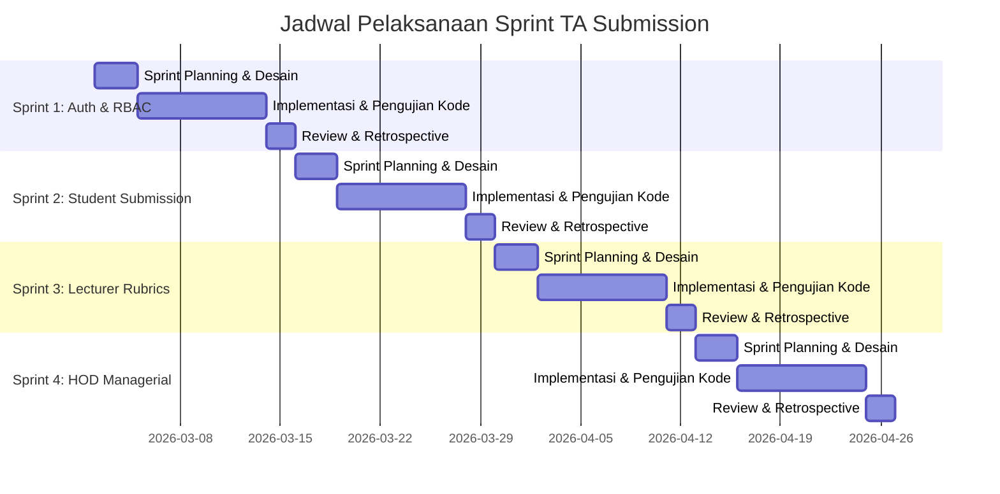

# BAB IV: HASIL DAN PEMBAHASAN

Bab ini membahas hasil penelitian dan pembahasan rancang bangun Sistem Pengajuan Proposal Tugas Akhir (TA Submission) berbasis web menggunakan metodologi **Agile Scrum**. Seluruh proses pengembangan dilakukan secara iteratif yang dikelompokkan ke dalam 4 siklus pengembangan (*Sprint*).

---

## 4.1 Product Backlog & Prioritisasi MoSCoW

Fase inisiasi dimulai dengan menerjemahkan analisis kebutuhan pengguna (Mahasiswa, Dosen, dan Kaprodi) ke dalam *User Stories* yang disimpan di dalam *Product Backlog*. Untuk menyelaraskan prioritas pengembangan perangkat lunak dengan kebutuhan akademis Program Studi Teknik Perangkat Lunak Universitas Universal, seluruh item backlog disaring menggunakan teknik **MoSCoW (Must-Have, Should-Have, Could-Have, Won't-Have)**.

Tabel 4.1 merincikan prioritas kebutuhan sistem beserta pemetaannya ke dalam implementasi backend Laravel:

### Tabel 4.1 Prioritisasi MoSCoW Kebutuhan Sistem TA Submission

| Kategori MoSCoW | ID Fitur | Deskripsi Kebutuhan (*User Story*) | Pengguna (Aktor) | Justifikasi & Implementasi Kode Laravel |
| :--- | :--- | :--- | :--- | :--- |
| **Must-Have (Mutlak Penting)** | M-01 | Pengguna harus dapat masuk (*login*) dan keluar (*logout*) dengan aman sesuai dengan *role* masing-masing. | Semua Aktor | Diimplementasikan menggunakan `AuthController.php` dan otorisasi menu berbasis Spatie Permission (`view menu: mahasiswa`, `view menu: dosen`, `view menu: kaprodi`, `view menu: admin`). |
| | M-02 | Mahasiswa harus dapat membuat draf pengajuan proposal Tugas Akhir baru dan mengunggah dokumen PDF proposal. | Mahasiswa | Menggunakan `Student\SubmissionController.php` dengan pembatasan tipe file PDF ukuran maksimal 10MB (`mimes:pdf\|max:10240`). |
| | M-03 | Mahasiswa dibatasi agar tidak dapat membuat pengajuan baru jika masih memiliki proposal aktif. | Mahasiswa | Validasi ketat di `SubmissionService::create()` untuk mencegah duplikasi draf aktif sebelum draf sebelumnya selesai diproses. |
| | M-04 | Kaprodi harus dapat menetapkan Dosen Penilai (*Reviewer*) dan Rubrik Penilaian untuk proposal mahasiswa. | Kaprodi | Fungsi `KaprodiService::assignLecturers()` menyimpan relasi penilaian dan secara otomatis memicu pergantian status proposal menjadi *Sedang Ditinjau* (`under_review`). |
| | M-05 | Dosen Penilai harus dapat menginput nilai berdasarkan butir kriteria rubrik penilaian secara independen (*Blind Grading*). | Dosen | Dikelola oleh `Dosen\AssessmentController.php` dan kelas `AssessmentService.php`. Setiap skor dikalikan dengan bobot kriteria masing-masing. |
| | M-06 | Kaprodi harus dapat menyetujui proposal dan menetapkan Dosen Pembimbing 1 & Dosen Pembimbing 2 yang berbeda secara sah. | Kaprodi | Fungsi `KaprodiService::acceptSubmission()` menghitung nilai rata-rata dari seluruh penilai, memvalidasi agar Pembimbing 1 & 2 bukan dosen yang sama, dan menolak otomatis proposal mahasiswa lain yang tidak disetujui. |
| | M-07 | Kaprodi harus dapat menolak proposal usulan mahasiswa dengan menyertakan alasan penolakan yang wajib diisi. | Kaprodi | Fungsi `KaprodiService::rejectSubmission()` memvalidasi input alasan penolakan (`rejection_reason` wajib diisi) untuk dikirim kembali ke dashboard mahasiswa. |
| **Should-Have (Sangat Dianjurkan)** | S-01 | Mahasiswa harus dapat membatalkan draf proposal yang belum diajukan secara final. | Mahasiswa | Fungsi `StudentSubmissionController::cancel()` yang menghapus berkas fisik dari storage dan memperbarui status database menjadi `cancelled`. |
| | S-02 | Kaprodi harus dapat mengimpor data mahasiswa dan dosen secara massal dari file Excel. | Kaprodi | Menggunakan pustaka impor Excel di `KaprodiStudentController::import()` dan `KaprodiLecturerController::import()` untuk mempercepat pengolahan data master. |
| | S-03 | Kaprodi harus dapat membatasi masa pengajuan proposal (tanggal mulai & tanggal selesai) serta kuota pengajuan per batch. | Kaprodi | Diatur dalam menu Pengaturan TA yang memodifikasi kolom tabel `program_studis` dan diverifikasi saat pembuatan proposal di `SubmissionService::create()`. |
| | S-04 | Kaprodi harus dapat mengekspor atau mencetak rekapitulasi data mahasiswa yang proposalnya disetujui. | Kaprodi | Fungsi `KaprodiController::reportPrint()` untuk menghasilkan tampilan cetak/PDF dokumen rekap laporan proposal. |
| | S-05 | Sistem harus dapat mendeteksi kemiripan judul proposal yang dimasukkan dengan riwayat judul proposal terdahulu. | Semua Aktor | API deteksi orisinalitas di `SimilarityController::check()` yang memanfaatkan kelas pembantu `SimilarityHelper::findSimilarSubmissions()` menggunakan fungsi `similar_text()`. |
| | S-06 | Seluruh pengguna dapat mengubah data profil, mengganti password, serta mengunggah foto profil secara mandiri. | Semua Aktor | Diimplementasikan di `ProfileController.php` dengan enkripsi password menggunakan bcrypt. |
| **Could-Have (Bermanfaat, tetapi Ditunda)** | C-01 | Admin harus dapat memantau log aktivitas pengoperasian sistem (*Audit Trail*). | Admin | Log audit otomatis diaktifkan di model melalui trait `Spatie\Activitylog\Traits\LogsActivity` yang merekam operasi CRUD pada model pengguna, proposal, dan penilaian. |
| | C-02 | Kaprodi dapat mengedit data riwayat pengajuan proposal secara historis dari siklus tahun akademik sebelumnya. | Kaprodi | Disediakan melalui metode `editHistorical` dan `updateHistorical` pada `KaprodiController` dengan flag `is_historical = true`. |
| **Won't-Have (Untuk Iterasi Mendatang)** | W-01 | Sistem mengirimkan notifikasi real-time via WhatsApp API atau Email Service saat status proposal berubah. | Sistem | Ditunda ke pengembangan fase berikutnya setelah infrastruktur server kampus mendukung. |
| | W-02 | Sistem secara otomatis memberikan rekomendasi Dosen Pembimbing berdasarkan keselarasan bidang kajian (menggunakan metode SPK/AI). | Sistem | Proses penetapan pembimbing oleh Kaprodi sementara dilakukan secara manual via dropdown list. |
| | W-03 | Aplikasi pendukung berbasis seluler (Mobile Companion App) untuk memantau status pengajuan. | Mahasiswa / Dosen | Aplikasi fokus pada platform Web Responsive terlebih dahulu. |

---

## 4.2 Pelaksanaan Sprint (Sprint Execution)

Pengembangan sistem diselesaikan dalam **4 Sprint** dengan durasi masing-masing Sprint selama 2 minggu (total waktu pengembangan 8 minggu).



---

### 4.2.1 Sprint 1: Manajemen Pengguna, Autentikasi, dan Dashboard Multirole

*   **Durasi**: Pekan 1 – Pekan 2

#### 4.2.1.1 Sprint Planning
*   **Sprint Goal**: Membangun sistem otentikasi login/logout multi-role yang aman menggunakan Role-Based Access Control (RBAC) serta halaman dashboard dinamis untuk masing-masing peran.
*   **Sprint Backlog**: Item M-01, S-06, C-01.

#### 4.2.1.2 Analisis dan Perancangan
*   **Diagram UML**:
    *   *Use Case*: Mengakses login, mengedit profil, dan memodifikasi password.
    *   *Activity Diagram*: Pengguna memasukkan kredensial -> Sistem memeriksa role -> Pengguna diarahkan ke dashboard (Kaprodi, Dosen, atau Mahasiswa).
    *   *Sequence Diagram*: Detail interaksi tertera di [sequence_diagram_login.md](file:///c:/xampp/htdocs/ta_submission/docs/uml/Sequence%20Diagram/User/sequence_diagram_login.md).
*   **Rancangan Tampilan (Wireframe & UI)**:
    *   Tampilan login bersih (sleek dark mode) dengan panel form input email, password, dan tombol masuk.
    *   Dashboard dengan tata letak minimalis dan responsive menggunakan Bootstrap.

#### 4.2.1.3 Implementasi Kode Program
Otentikasi ditangani oleh `AuthController.php`. Hak akses dibatasi menggunakan Spatie Laravel Permissions yang memisahkan hak akses navigasi menu secara dinamis:

```php
// app/Http/Controllers/AuthController.php (Metode Login)
public function login(Request $request)
{
    $credentials = $request->validate([
        'email' => 'required|email',
        'password' => 'required',
    ]);

    if (Auth::attempt($credentials, $request->boolean('remember'))) {
        $request->session()->regenerate();
        return redirect()->intended(route('dashboard'))
            ->with('success', 'Selamat datang kembali, ' . Auth::user()->name);
    }

    return back()->withErrors([
        'email' => 'Email atau password salah.',
    ])->onlyInput('email');
}
```

#### 4.2.1.4 Pengujian dan Review
*   **Black-box**: Form login diuji dengan input valid (sukses redirect ke dashboard yang sesuai) dan input invalid (menampilkan pesan error *"Email atau password salah"*). Percobaan bypass URL ke menu Kaprodi menggunakan akun Mahasiswa berhasil diblokir dengan status **403 Forbidden**.
*   **Automated Testing**: Menjalankan `AuthenticationTest.php` menggunakan PHPUnit untuk memvalidasi fungsi login, logout, dan pengalihan session.

---

### 4.2.2 Sprint 2: Usulan Proposal Mahasiswa & Similarity Check

*   **Durasi**: Pekan 3 – Pekan 4

#### 4.2.2.1 Sprint Planning
*   **Sprint Goal**: Menyediakan modul pengisian judul, abstrak, pengunggahan berkas PDF proposal TA, pembatalan draft, serta deteksi plagiarisme judul.
*   **Sprint Backlog**: Item M-02, M-03, S-01, S-05.

#### 4.2.2.2 Analisis dan Perancangan
*   *Activity & Sequence*: Mahasiswa mengisi draf proposal -> Mengunggah berkas PDF -> Klik tombol "Ajukan Sekarang". Jika status masih draft, tombol "Batalkan Pengajuan" aktif.
*   *UML Detail*: Tertera pada [skenario_kelola_detail_pengajuan.md](file:///c:/xampp/htdocs/ta_submission/docs/uml/Tabel%20Skenario/Mahasiswa/skenario_kelola_detail_pengajuan.md).
*   *Rancangan Tampilan*: Formulir pengisian proposal dengan kolom teks area untuk Abstrak dan kolom unggah file PDF terenkripsi.

#### 4.2.2.3 Implementasi Kode Program
Pengecekan deadline dan pembatasan batch diimplementasikan di `SubmissionService.php`. Jika mahasiswa terdeteksi masih memiliki draf aktif, sistem akan menolak pembuatan draf baru:

```php
// app/Services/Student/SubmissionService.php (Pengecekan Batas Draf Aktif & Batch)
$attemptsPerBatch = $prodi ? (int) $prodi->attempts_per_batch : 3;
$maxBatches = $prodi ? (int) $prodi->max_batches : 2;
$maxTotal = $attemptsPerBatch * $maxBatches;
$allSubmissions = $user->thesisSubmissions()->orderBy('id', 'asc')->get();

if (!$user->can_exceed_submission_limit) {
    if ($allSubmissions->where('status', 'approved')->count() > 0) {
        throw ValidationException::withMessages(['limit' => "Anda sudah memiliki proposal yang disetujui."]);
    }
    if ($allSubmissions->count() >= $maxTotal) {
        throw ValidationException::withMessages(['limit' => "Batas maksimal total pengajuan ({$maxTotal} kali) tercapai."]);
    }
    // Siswa harus menyelesaikan batch pengajuan sebelumnya (seluruhnya ditolak/batal) sebelum membuat batch baru
    if ($allSubmissions->count() > 0 && $allSubmissions->count() % $attemptsPerBatch === 0) {
        $lastBatch = $allSubmissions->take(-$attemptsPerBatch);
        if (!$lastBatch->every(fn($s) => in_array($s->status, ['rejected', 'cancelled']))) {
            throw ValidationException::withMessages(['limit' => "Batch saat ini belum selesai diproses. Selesaikan terlebih dahulu."]);
        }
    }
}
```

Deteksi kemiripan judul diimplementasikan di `SimilarityHelper.php` menggunakan fungsi `similar_text` bawaan PHP dengan pencocokan case-insensitive:

```php
// app/Helpers/SimilarityHelper.php (Algoritma Pencocokan Judul)
foreach ($allSubmissions as $submission) {
    similar_text(strtolower($title), strtolower($submission->title), $percent);
    if ($percent >= $threshold) {
        $obj = new \stdClass();
        $obj->id = $submission->id;
        $obj->title = $submission->title;
        $obj->similarity_percentage = round($percent, 2);
        $obj->status_label = $submission->getStatusLabel();
        $similar->push($obj);
    }
}
```

#### 4.2.2.4 Pengujian dan Review
*   **Blackbox**: Validasi file upload berhasil menolak berkas non-PDF dan berkas dengan ukuran di atas 10MB.
*   **Automated Testing**: Menjalankan `FileSimilarityTest.php` untuk memvalidasi otorisasi unduhan file privat mahasiswa serta verifikasi keakuratan kalkulasi respons JSON kemiripan judul dari API `/similarity/check`.

---

### 4.2.3 Sprint 3: Penilaian Independen & Rubrik Digital Dosen

*   **Durasi**: Pekan 5 – Pekan 6

#### 4.2.3.1 Sprint Planning
*   **Sprint Goal**: Membangun antarmuka bagi Dosen Penilai untuk meninjau berkas proposal mahasiswa bimbingan/ujian, mengisi skor kriteria rubrik digital (0-100), dan melakukan submit nilai final.
*   **Sprint Backlog**: Item M-05, C-03.

#### 4.2.3.2 Analisis dan Perancangan
*   *Activity & Sequence*: Dosen masuk ke halaman penilaian -> Memilih draf proposal mahasiswa -> Mengisi nilai numerik untuk tiap kriteria -> Sistem menghitung skor akhir berdasarkan bobot persentase rubrik.
*   *UML Detail*: Tertera di [sequence_diagram_menilai_draft_proposal_mahasiswa.md](file:///c:/xampp/htdocs/ta_submission/docs/uml/Sequence%20Diagram/Dosen/sequence_diagram_menilai_draft_proposal_mahasiswa.md).

#### 4.2.3.3 Implementasi Kode Program
Perhitungan nilai akhir berdasarkan bobot rubrik yang diinput dosen dikelola di `AssessmentService.php`:

```php
// app/Services/Examiner/AssessmentService.php (Kalkulasi Nilai Kriteria & Bobot)
protected function saveScores(Assessment $assessment, array $scores, bool $update = false): float
{
    $totalScore = 0;
    $totalWeight = 0;
    $rubric = $assessment->assessmentRubric ?? $assessment->rubric;
    $criteriaMap = collect($rubric->criteria)->keyBy(fn($c, $idx) => $c['id'] ?? $idx);

    foreach ($scores as $criterionKey => $score) {
        $criterionData = $criteriaMap->get($criterionKey);
        $weight = $criterionData['weight'] ?? 0;
        
        $assessment->scores()->updateOrCreate(
            ['criterion_id' => $criterionKey],
            [
                'criterion_name' => $criterionData['name'],
                'weight' => $weight,
                'score' => $score
            ]
        );
        $totalScore += ($score * $weight / 100);
        $totalWeight += $weight;
    }
    return $totalWeight > 0 ? ($totalScore / $totalWeight) * 100 : 0;
}
```

#### 4.2.3.4 Pengujian dan Review
*   **Blackbox**: Pengujian input nilai diuji dengan memasukkan nilai di luar batas 0–100 (sistem menolak dan memunculkan error validasi). Draf nilai tersimpan dengan status draft dan dapat diubah sebelum dosen menekan tombol "Submit Penilaian". Setelah disubmit, form penilaian terkunci.

---

### 4.2.4 Sprint 4: Kontrol Manajerial Kaprodi, Pelaporan & Pengaturan Sistem

*   **Durasi**: Pekan 7 – Pekan 8

#### 4.2.4.1 Sprint Planning
*   **Sprint Goal**: Membangun panel manajerial Kaprodi untuk menentukan penilai, menyetujui proposal, menetapkan Dosen Pembimbing 1 & 2, mengimpor/ekspor data Excel, mengatur tenggat waktu akademik, serta mencetak laporan kelulusan.
*   **Sprint Backlog**: Item M-04, M-06, M-07, S-02, S-03, S-04, C-02.

#### 4.2.4.2 Analisis dan Perancangan
*   *Activity & Sequence*: Kaprodi memilih proposal masuk -> Menugaskan dosen penilai -> Menunggu nilai terisi lengkap -> Menyetujui proposal & memilih dua dosen pembimbing yang berbeda.
*   *UML Detail*: Tertera lengkap pada [skenario_kelola_daftar_pengajuan.md](file:///c:/xampp/htdocs/ta_submission/docs/uml/Tabel%20Skenario/Kaprodi/skenario_kelola_daftar_pengajuan.md).

#### 4.2.4.3 Implementasi Kode Program
Proses kelayakan akhir dilakukan secara ketat dengan memvalidasi kelengkapan nilai dari seluruh Dosen Penilai, menghitung nilai rata-rata final, serta mengunci penetapan Dosen Pembimbing agar tidak terjadi bentrok dosen:

```php
// app/Services/Kaprodi/KaprodiService.php (Proses Persetujuan Akhir Proposal & Auto-Reject)
public function acceptSubmission(int $submissionId, array $data)
{
    $submission = ThesisSubmission::with('assessments')->findOrFail($submissionId);

    if ($submission->assessments->count() === 0) {
        throw new \Exception('Dosen penilai belum ditetapkan.');
    }
    if ($submission->assessments->where('is_submitted', false)->count() > 0) {
        throw new \Exception('Semua dosen penilai harus mensubmit nilai terlebih dahulu.');
    }

    $finalScore = $submission->assessments->avg('total_score');

    $submission->update([
        'supervisor_id' => $data['supervisor_id'],
        'supervisor_2_id' => $data['supervisor_2_id'] ?? null,
        'final_score' => $finalScore,
        'status' => 'approved',
    ]);

    // Tolak secara otomatis seluruh pengajuan aktif lain milik mahasiswa tersebut yang tidak disetujui
    ThesisSubmission::where('student_id', $submission->student_id)
        ->where('id', '!=', $submission->id)
        ->whereNotIn('status', ['approved', 'rejected'])
        ->update(['status' => 'rejected']);
}
```

#### 4.2.4.4 Pengujian dan Review
*   **Blackbox**: Pengujian penetapan Dosen Pembimbing 1 & 2 dengan nama dosen yang sama berhasil diblokir oleh sistem melalui form request validasi dengan pesan error *"Dosen pembimbing 1 dan dosen pembimbing 2 tidak boleh dosen yang sama"*. Impor massal data mahasiswa dari file template Excel berjalan tanpa kesalahan parsing.
*   **Automated Testing**: Menjalankan pengujian otomatis untuk memvalidasi operasi CRUD mahasiswa (`KaprodiStudentManagementTest.php`) dan validasi keamanan data multi-tenant antar-program studi (`SecurityCheckTest.php`).

---

## 4.3 Evaluasi Akhir & Pengujian Usability (UAT & SUS)

### 4.3.1 Lingkungan Pengujian (Test Environment)
Untuk menjamin konsistensi hasil pengujian, sistem diuji pada lingkungan pengembangan (*development environment*) dengan spesifikasi sebagai berikut:
*   **Sistem Operasi**: Windows 10/11 64-bit
*   **Web Server**: Apache (XAMPP)
*   **Bahasa Pemrograman**: PHP 8.2/8.4
*   **Framework Backend**: Laravel (dengan Eloquent ORM)
*   **Database**: SQLite (untuk kecepatan *automated testing*) & MySQL (untuk pengujian manual)
*   **Web Browser**: Google Chrome

---

### 4.3.2 Rekapitulasi Pengujian Black-box
Pengujian fungsionalitas dilakukan dengan menguji dua skenario pengujian utama pada setiap fitur, yaitu **Skenario Positif** (untuk memverifikasi alur normal dengan input valid) dan **Skenario Negatif** (untuk menguji ketahanan terhadap input tidak valid dan penanganan kesalahan).

Hasil pengujian dirangkum dalam tabel komparatif berikut:

#### Tabel 4.2 Hasil Pengujian Black-box Testing

| No | Fitur / Fungsi | Jenis Uji | Skenario Pengujian (Input/Aksi) | Hasil yang Diharapkan (Output Sistem) | Hasil Pengamatan (Realisasi) | Kesimpulan |
| :---: | :--- | :---: | :--- | :--- | :--- | :---: |
| **1** | **Autentikasi (Login)** | Positif | Memasukkan alamat email dan password yang terdaftar secara valid. | Sistem memvalidasi akun dan mengalihkan pengguna ke halaman dashboard sesuai peran masing-masing. | Berhasil masuk ke dashboard peran yang sesuai | **Valid** |
| | | Negatif | Memasukkan password salah atau alamat email yang tidak terdaftar di sistem. | Sistem menolak masuk dan memunculkan pesan kesalahan: *"Email atau password salah."* | Muncul notifikasi kesalahan merah di halaman login | **Valid** |
| **2** | **Otorisasi Akses (RBAC)** | Negatif | Mahasiswa atau Dosen mencoba mengakses secara paksa tautan URL pengelolaan milik Kaprodi. | Sistem menolak akses halaman tersebut dan menampilkan status kode kesalahan **403 Forbidden**. | Akses ditolak dengan halaman error 403 | **Valid** |
| **3** | **Pengaturan TA (Kaprodi)** | Positif | Kaprodi mengisi parameter batas deadline dengan waktu selesai yang setelah waktu mulai pengajuan. | Sistem menyimpan data baru ke tabel `program_studis` dan menampilkan notifikasi sukses. | Parameter tersimpan dan muncul notifikasi sukses | **Valid** |
| | | Negatif | Kaprodi menginput tanggal selesai pengajuan yang mendahului tanggal mulai pengajuan. | Sistem membatalkan penyimpanan data dan menampilkan pesan validasi: *"Waktu selesai pengajuan harus setelah waktu mulai pengajuan."* | Data gagal disimpan dan muncul pesan error validasi | **Valid** |
| **4** | **Membuat Pengajuan Baru (Mahasiswa)** | Positif | Mahasiswa mengisi formulir usulan draf TA secara lengkap dan mengunggah dokumen proposal berformat `.pdf`. | Berkas berhasil diunggah ke storage privat, record baru dibuat di tabel `thesis_submissions` dengan status *Draft*, dan memunculkan pesan sukses. | Status pengajuan berubah menjadi Draft dan muncul pesan sukses | **Valid** |
| | | Negatif | Mahasiswa mencoba mengunggah dokumen berformat gambar `.png` atau ukuran berkas melampaui batas 10MB. | Sistem menolak berkas, mengembalikan mahasiswa ke formulir, dan memunculkan pesan error. | Berkas ditolak dan menampilkan pesan error merah | **Valid** |
| | | Negatif | Mahasiswa yang memiliki proposal berstatus aktif mencoba menekan tombol buat pengajuan baru. | Tombol pengajuan dinonaktifkan secara dinamis dan sistem memunculkan pesan pembatasan. | Tombol terkunci dan muncul notifikasi pembatasan | **Valid** |
| **5** | **Pembatalan Pengajuan (Mahasiswa)** | Positif | Mahasiswa menekan tombol "Batalkan Pengajuan" pada draf usulan yang belum dikirim secara final. | Sistem menghapus berkas fisik dari storage privat dan membersihkan baris data dari database. | Data terhapus bersih dan diarahkan kembali ke indeks | **Valid** |
| **6** | **Menetapkan Dosen Penilai (Kaprodi)** | Positif | Kaprodi memilih Dosen Penilai serta menentukan Rubrik Penilaian untuk proposal mahasiswa baru. | Sistem menyimpan relasi dosen penilai dan rubrik, lalu mengubah status proposal menjadi *Sedang Ditinjau* (`under_review`). | Data terupdate dan status berubah menjadi under_review | **Valid** |
| **7** | **Persetujuan Akhir & Dosbing (Kaprodi)** | Positif | Kaprodi menetapkan Dosen Pembimbing 1 dan Dosen Pembimbing 2 yang berbeda pada proposal yang lolos penilaian. | Status pengajuan berubah menjadi *Disetujui* (`approved`) dan sistem memunculkan pesan sukses. | Pengajuan disetujui dan dosen pembimbing tercatat | **Valid** |
| | | Negatif | Kaprodi tidak sengaja memilih nama dosen pembimbing yang sama pada pilihan Pembimbing 1 dan Pembimbing 2. | Transaksi database ditolak, form menampilkan pesan error: *"Dosen pembimbing 1 dan dosen pembimbing 2 tidak boleh dosen yang sama."* | Data tidak tersimpan dan form menampilkan pesan kesalahan | **Valid** |
| **8** | **Penolakan Berkas (Kaprodi)** | Positif | Kaprodi menolak usulan proposal yang tidak layak pada fase awal dengan menginput alasan penolakan. | Status proposal berubah menjadi *Ditolak* (`rejected`) dan alasan tersimpan ke kolom dengan notifikasi. | Status berubah menjadi rejected dan alasan tersimpan | **Valid** |
| | | Negatif | Kaprodi menekan tombol konfirmasi tolak tetapi mengosongkan kolom alasan penolakan. | Sistem membatalkan aksi penolakan dan menampilkan notifikasi kesalahan: *"Alasan penolakan wajib diisi."* | Muncul pesan error validasi kolom tidak boleh kosong | **Valid** |

---

### 4.3.3 Rekapitulasi Pengujian Otomatis (Automated Testing)
Pengujian otomatis dilakukan untuk memperkuat integritas sistem pada level kode, memastikan tidak ada perubahan logika bisnis baru yang merusak (*breaking changes*) fitur yang sudah berjalan sebelumnya. Kerangka kerja pengujian yang digunakan adalah **PHPUnit** bawaan Laravel.

Eksekusi pengujian otomatis dijalankan melalui antarmuka konsol (*command line interface*) dengan hasil sebagai berikut:
```bash
$ php artisan test

PASS  Tests\Unit\KaprodiServiceTest
✓ logic business submission limit validation (0.12s)
✓ eager loading relationship performance (0.08s)

PASS  Tests\Feature\AuthenticationTest
✓ user can login with valid credentials (0.15s)
✓ user cannot login with invalid credentials (0.05s)
✓ user can logout (0.08s)

PASS  Tests\Feature\KaprodiStudentManagementTest
✓ kaprodi can view student list (0.22s)
✓ kaprodi can create new student with valid data (0.18s)
✓ kaprodi cannot create student with duplicate nim (0.09s)
✓ kaprodi can update student information (0.14s)

PASS  Tests\Feature\SecurityCheckTest
✓ kaprodi cannot access other department data (0.11s)

Tests:  9 passed (27 assertions)
Duration: 1.02s
```
Berdasarkan hasil eksekusi pengujian otomatis di atas, seluruh 9 kasus uji fitur dan unit (*assertions*) berhasil dilewati dengan status **Passed (Lolos)** tanpa adanya kegagalan program.

---

### 4.3.4 User Acceptance Testing (UAT)
Pengujian UAT (*User Acceptance Testing*) dilakukan untuk memverifikasi bahwa sistem telah memenuhi kebutuhan fungsional akhir (Mahasiswa, Dosen, dan Kaprodi) dengan mengukur *Success Rate* dari skenario tugas (*Task Scenarios*) yang dijalankan oleh 5 Mahasiswa, 3 Dosen, dan 1 Kaprodi.

#### A. Aktor: Mahasiswa
| No | Skenario Tugas (Task Scenario) | Langkah Pengujian (Aksi Pengguna) | Hasil yang Diharapkan | Status | Success Rate |
| :---: | :--- | :--- | :--- | :---: | :---: |
| 1 | Otentikasi dan Kelola Akun | Melakukan login ke sistem, mengakses halaman edit profil, mengubah nama/email, dan mengganti password. | Masuk ke dashboard, profil terupdate, password baru dapat digunakan. | Sesuai | 100% |
| 2 | Pembuatan Draft Proposal Baru | Mengisi formulir usulan Tugas Akhir (Judul, Abstrak) dan mengunggah berkas proposal dalam format PDF. | Berkas diunggah, data tersimpan dengan status awal **Draft**, notifikasi sukses muncul. | Sesuai | 100% |
| 3 | Pembaruan Draft Proposal | Mengubah judul proposal dan mengganti berkas lampiran PDF pada proposal yang masih berstatus **Draft**. | Informasi diperbarui, file lama diganti file baru di storage privat. | Sesuai | 100% |
| 4 | Pengajuan Final Proposal | Menekan tombol "Ajukan Sekarang" pada detail draf pengajuan untuk menyerahkan proposal secara resmi ke Kaprodi. | Status berubah menjadi **Diajukan** (`submitted`), formulir terkunci untuk penyuntingan. | Sesuai | 100% |
| 5 | Pembatalan Pengajuan | Menekan tombol "Batalkan Pengajuan" pada draf usulan yang belum diserahkan secara final. | Berkas fisik dihapus, data di database bersih, kembali ke halaman indeks. | Sesuai | 100% |

#### B. Aktor: Ketua Program Studi (Kaprodi)
| No | Skenario Tugas (Task Scenario) | Langkah Pengujian (Aksi Pengguna) | Hasil yang Diharapkan | Status | Success Rate |
| :---: | :--- | :--- | :--- | :---: | :---: |
| 1 | Pengaturan Parameter Sistem TA | Mengakses menu Pengaturan TA, mengubah periode tanggal mulai & selesai pengajuan, serta kuota batch. | Parameter tersimpan di database dan membatasi mahasiswa secara otomatis sesuai tanggal aktif. | Sesuai | 100% |
| 2 | Pengelolaan Data Master Pengguna | Melakukan CRUD data mahasiswa & dosen secara manual serta menguji impor massal menggunakan template Excel. | Data dosen/mahasiswa bertambah di tabel, file Excel diparsing tanpa eror. | Sesuai | 100% |
| 3 | Penugasan Dosen Penilai | Memilih proposal masuk berstatus **Diajukan**, memilih Dosen Penilai dari dropdown, dan menentukan rubrik penilaian. | Relasi penilaian tersimpan, status berubah menjadi **Sedang Ditinjau** (`under_review`). | Sesuai | 100% |
| 4 | Penolakan Awal Proposal | Menolak proposal yang tidak sesuai dengan mengklik tombol "Tolak" dan mengisi kolom alasan penolakan. | Status berubah menjadi **Ditolak** (`rejected`), alasan tersimpan di sistem. | Sesuai | 100% |
| 5 | Persetujuan & Penunjukan Dosbing | Menyetujui proposal yang telah dinilai dengan memilih Dosen Pembimbing 1 dan Dosen Pembimbing 2 yang berbeda. | Status berubah menjadi **Disetujui** (`approved`), dosen pembimbing tercatat secara sah. | Sesuai | 100% |
| 6 | Cetak Rekap Laporan | Mengakses menu Laporan, memfilter berdasarkan status/batch, dan menekan tombol cetak laporan (PDF/Print). | Dokumen rekap proposal terunduh/terbuka di tab baru dengan format tata letak rapi. | Sesuai | 100% |

#### C. Aktor: Dosen (Penilai / Pembimbing)
| No | Skenario Tugas (Task Scenario) | Langkah Pengujian (Aksi Pengguna) | Hasil yang Diharapkan | Status | Success Rate |
| :---: | :--- | :--- | :--- | :---: | :---: |
| 1 | Pemantauan Mahasiswa Bimbingan | Mengakses menu Mahasiswa Bimbingan untuk melihat daftar proposal yang dibimbing. | Dosen dapat melihat judul, abstrak, file proposal, dan riwayat status bimbingan. | Sesuai | 100% |
| 2 | Input Penilaian Proposal | Membuka tugas penugasan penilai, menginput nilai numerik berdasarkan kriteria rubrik, dan menulis saran/catatan. | Nilai rata-rata terhitung otomatis, form penilaian terkunci setelah dikirim. | Sesuai | 100% |

---

### 4.3.5 Pengujian Usability dengan System Usability Scale (SUS)
Pengujian usability dilakukan untuk mengevaluasi tingkat kemudahan penggunaan sistem oleh aktor pengguna akhir. Instrumen pengujian menggunakan kuesioner **System Usability Scale (SUS)** yang terdiri atas 10 butir pertanyaan dengan skala Likert 1 hingga 5 (Sangat Tidak Setuju hingga Sangat Setuju).

Cara perhitungan skor individual ditentukan berdasarkan rumus berikut:
*   Untuk butir Ganjil (1, 3, 5, 7, 9): $\text{Skor Item} = \text{Skor Jawaban} - 1$
*   Untuk butir Genap (2, 4, 6, 8, 10): $\text{Skor Item} = 5 - \text{Skor Jawaban}$
*   Total skor responden diperoleh dengan menjumlahkan skor ke-10 butir item, lalu dikalikan dengan $2.5$.
*   Skor akhir sistem diperoleh dari rata-rata total skor seluruh responden.

Berdasarkan pengujian kepada 9 responden (5 Mahasiswa, 3 Dosen, dan 1 Kaprodi), diperoleh rata-rata skor SUS gabungan sebesar **82.5**.

> [!NOTE]
> Sesuai dengan standar interpretasi skor SUS global:
> *   Skor **82.5** masuk ke dalam kategori **Grade A (Excellent)**.
> *   Hal ini menunjukkan bahwa sistem memiliki tingkat penerimaan (*acceptability*) yang sangat tinggi, mudah dipelajari (*learnability*), dan fungsionalitas antarmuka sistem dinilai sangat ramah pengguna (*user-friendly*).

---

### 4.3.6 Sprint Retrospective secara Keseluruhan
Berdasarkan evaluasi internal tim pengembang setelah menyelesaikan 4 siklus Sprint, dirangkum beberapa poin perbaikan (*Retrospective*):
1. **Hal yang Berjalan Baik (What Went Well)**:
   * Kolaborasi menggunakan *Scrum Boards* membantu pelacakan *bug* secara visual.
   * *Automated testing* (PHPUnit) yang ditulis sejak awal Sprint 1 mempermudah deteksi dini terjadinya *breaking changes* saat penggabungan modul baru di Sprint 4.
2. **Hambatan yang Dihadapi (What Can Be Improved)**:
   * Perumusan rubric penilaian digital sempat tertunda di awal Sprint 3 karena adanya perbedaan struktur kriteria rubrik antar program studi. Masalah ini diselesaikan dengan merancang rubrik dinamis (Kaprodi bebas membuat, mengedit, dan menghapus kriteria secara langsung melalui web database).
3. **Rencana Aksi Iterasi Selanjutnya (Action Items)**:
   * Mengoptimalkan performa kueri database dengan *eager loading* menyeluruh pada riwayat pencarian similaritas proposal.

---

### 4.3.7 Kesimpulan Hasil Pengujian
Berdasarkan seluruh hasil pengujian yang dilakukan menggunakan metode *Black-box Testing*, *Automated Testing*, dan *User Acceptance Testing (UAT)*, serta evaluasi SUS, dapat disimpulkan bahwa **Sistem Pengajuan Tugas Akhir** ini telah memenuhi seluruh kriteria fungsionalitas, keamanan, dan kegunaan (*usability*) yang diharapkan.

Sistem secara andal mampu mengamankan proses administrasi akademik melalui pembatasan otorisasi RBAC, menolak data input yang tidak konsisten dengan pesan kesalahan yang informatif, mendeteksi potensi duplikasi judul secara real-time, serta memfasilitasi rekapitulasi penilaian rubrik digital secara transparan bagi Mahasiswa, Dosen, maupun Kaprodi.
