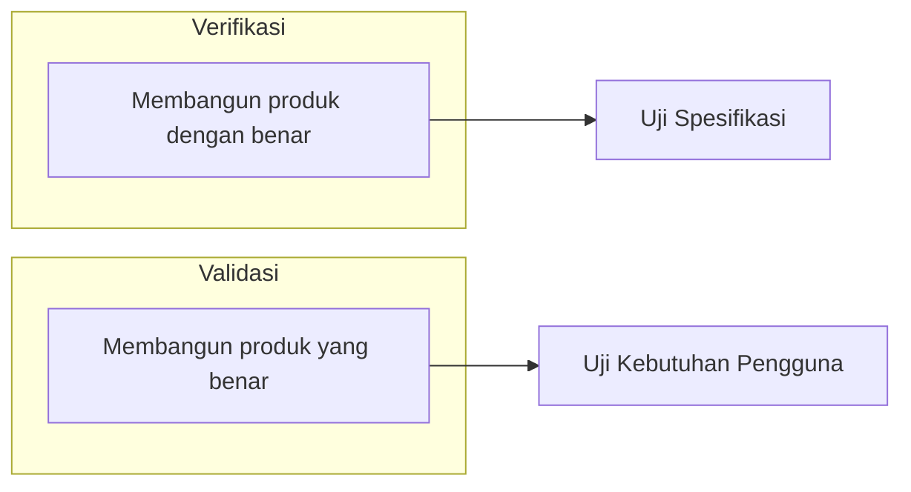

# Modul 1: Pengantar Pengujian Perangkat Lunak

Pengujian perangkat lunak (*Software Testing*) bukan sekadar aktivitas untuk mencari kesalahan (*bug*) di akhir masa pengembangan. Pengujian merupakan proses investigasi empiris yang dilakukan secara sistematis untuk memberikan informasi objektif mengenai kualitas dari produk perangkat lunak kepada pemangku kepentingan (*stakeholders*).

---

## 🛡️ 1. Definisi Kualitas Perangkat Lunak dan Bug

### Kualitas Perangkat Lunak (Software Quality)
Menurut standar **ISO/IEC 25010**, kualitas perangkat lunak adalah tingkat di mana produk perangkat lunak memenuhi kebutuhan yang dinyatakan (*stated needs*) dan kebutuhan yang tersirat (*implied needs*) dari para penggunanya. Kualitas tidak hanya diukur dari apakah program dapat berjalan tanpa eror, tetapi juga meliputi efisiensi performa, keamanan, kemudahan penggunaan (*usability*), portabilitas, dan kemudahan pemeliharaan (*maintainability*).

### Apa itu Bug?
Secara akademis dan praktis, terdapat rantai kegagalan yang membedakan istilah-istilah berikut:
1.  **Error (Mistake)**: Tindakan manusia (misalnya kesalahan logika berpikir oleh programmer saat menulis kode) yang menghasilkan hasil yang salah.
2.  **Fault (Defect/Bug)**: Representasi fisik dari kesalahan tersebut di dalam kode program (misalnya salah menulis operator perbandingan `<` yang seharusnya `<=`).
3.  **Failure**: Ketidakmampuan sistem untuk menjalankan fungsinya sesuai spesifikasi saat dijalankan (misalnya aplikasi tiba-tiba crash atau menampilkan layar kosong saat pengguna mengklik tombol).

> [!IMPORTANT]
> **Defect** berada di dalam kode, sedangkan **Failure** terjadi ketika kode yang mengandung defect tersebut dieksekusi di lingkungan runtime. Tujuan pengujian adalah menemukan *defect* sebelum mereka menjelma menjadi *failure* di tangan pengguna akhir.

---

## 💸 2. Mengapa Kita Melakukan Pengujian?

Pengujian sering kali dianggap sebagai beban biaya tambahan (*overhead*) dalam proyek. Namun secara empiris, ketiadaan pengujian yang memadai dapat menyebabkan kerugian yang jauh lebih besar dalam tiga aspek utama:

### A. Aspek Finansial
Biaya untuk memperbaiki bug meningkat secara eksponensial seiring berjalannya waktu dalam siklus hidup perangkat lunak (*Software Development Life Cycle* - SDLC).
*   Menemukan bug saat menulis kode: **Biaya minimal** (hanya butuh beberapa menit refactoring).
*   Menemukan bug setelah rilis produksi: **Biaya maksimal** (memerlukan patch darurat, kueri perbaikan database, kompensasi kerugian pengguna, serta waktu developer yang terbuang).

### B. Aspek Reputasi
Di era digital, keandalan sistem adalah representasi langsung dari kredibilitas institusi. Gangguan sistem yang berulang pada aplikasi publik dapat menurunkan tingkat kepercayaan pengguna secara drastis.

### C. Aspek Keselamatan (Safety-Critical Systems)
Pada sistem tertentu seperti perangkat medis, kendali penerbangan, atau sistem keuangan berskala besar, kegagalan perangkat lunak dapat berakibat fatal pada hilangnya nyawa manusia atau kerugian ekonomi massal.

---

## ⚖️ 3. Perbedaan Antara Verifikasi (Verification) vs Validasi (Validation)

Dalam disiplin rekayasa perangkat lunak, dua aktivitas ini sering kali disalahpahami sebagai hal yang sama, padahal keduanya memiliki fokus yang berbeda:

### Verifikasi (Verification)
*   **Pertanyaan Kunci**: *"Are we building the product right?"* (Apakah kita membangun produk ini dengan benar?)
*   **Fokus**: Memastikan perangkat lunak memenuhi spesifikasi teknis dan dokumen perancangan yang telah ditentukan.
*   **Aktivitas**: Review kode, inspeksi desain, analisis statis, dan pencocokan dengan UML.

### Validasi (Validation)
*   **Pertanyaan Kunci**: *"Are we building the right product?"* (Apakah kita membangun produk yang benar?)
*   **Fokus**: Memastikan perangkat lunak memenuhi kebutuhan aktual dan ekspektasi dari pengguna akhir (*user requirements*).
*   **Aktivitas**: *User Acceptance Testing* (UAT), demonstrasi fitur kepada klien, dan pengujian alur bisnis operasional.

---

## 📜 4. Prinsip-Prinsip Utama dalam Pengujian

Menulis pengujian yang efektif memerlukan pemahaman terhadap beberapa prinsip fundamental yang dirumuskan oleh para pakar ilmu komputer:

### A. Pengujian Menunjukkan Adanya Defect, Bukan Ketiadaannya
*Prinsip Edsger W. Dijkstra*: Pengujian dapat membuktikan bahwa perangkat lunak memiliki bug, tetapi tidak akan pernah bisa membuktikan bahwa perangkat lunak tersebut 100% bebas dari bug. Tujuan pengujian adalah menekan jumlah defect seminimal mungkin.

### B. Pengujian Melelahkan (Exhaustive Testing) Adalah Mustahil
Menguji seluruh kombinasi input dan prasyarat secara mutlak adalah hal yang tidak realistis (kecuali untuk program yang sangat sederhana). Oleh karena itu, pengujian harus diprioritaskan menggunakan analisis risiko dan teknik sistematis seperti *Equivalence Partitioning* dan *Boundary Value Analysis*.

### C. Pengujian Dini (Early Testing)
Aktivitas pengujian harus dimulai sedini mungkin dalam siklus SDLC (seperti konsep *Test-Driven Development* atau review dokumen kebutuhan) untuk meminimalkan biaya perbaikan kesalahan logika.

### D. Pengelompokan Defect (Defect Clustering)
Secara empiris, sebagian besar bug yang ditemukan selama pengujian biasanya terkonsentrasi pada sejumlah kecil modul inti aplikasi. Ini sesuai dengan Prinsip Pareto (80% kegagalan disebabkan oleh 20% modul berkode kompleks).

### E. Paradoks Pestisida (Pesticide Paradox)
Jika sekumpulan tes yang sama dijalankan berulang-ulang, tes tersebut pada akhirnya tidak akan mampu menemukan bug baru. Tes otomatis harus terus ditinjau, diperbarui, dan ditulis ulang untuk menjangkau bagian kode yang baru dimodifikasi.
