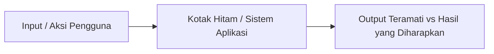
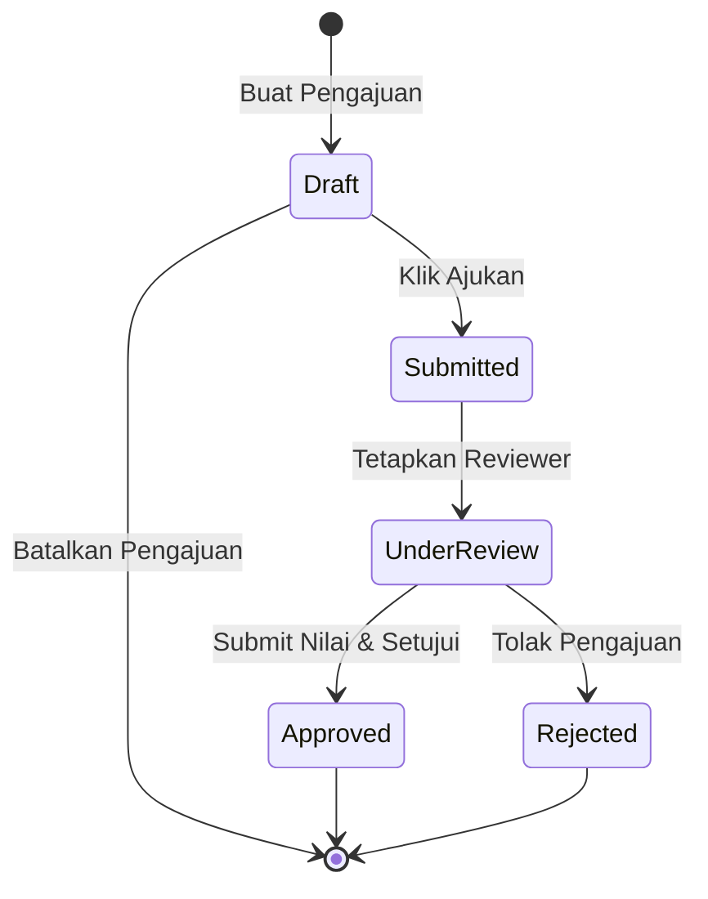

# Modul 2: Black Box Testing (Pengujian Kotak Hitam)

**Black Box Testing** (juga dikenal sebagai *Functional Testing* atau *Behavioral Testing*) adalah metode pengujian perangkat lunak di mana fungsionalitas aplikasi diuji tanpa memiliki pengetahuan tentang struktur kode internal, detail implementasi, atau jalur eksekusi dalam aplikasi.

Penguji hanya berfokus pada **input** yang dimasukkan dan **output** yang dihasilkan untuk memverifikasi kesesuaian dengan dokumen spesifikasi kebutuhan.

---

## 🧭 1. Esensi Black Box Testing

Pada Black Box Testing, sistem diperlakukan sebagai sebuah "Kotak Hitam" yang tertutup. Penguji tidak perlu tahu apakah aplikasi ditulis dalam PHP (Laravel), JavaScript, Java, atau menggunakan pola desain MVC. 

### Fokus Utama Pengujian:
1.  **Fungsi yang tidak benar atau hilang**: Apakah tombol menyimpan data dengan benar?
2.  **Kesalahan antarmuka (Interface Errors)**: Apakah data yang ditampilkan pada tabel sesuai dengan input?
3.  **Kesalahan struktur data atau akses database**: Apakah relasi data tersimpan dengan benar?
4.  **Kesalahan performa**: Apakah respons sistem melebihi batas waktu toleransi?
5.  **Kesalahan inisialisasi dan terminasi**: Apakah sesi pengguna terhapus setelah logout?

---

## 🛠️ 2. Teknik-Teknik Utama Black Box Testing

Karena menguji setiap kemungkinan input (*exhaustive testing*) adalah hal yang mustahil, kita menggunakan teknik-teknik matematis berikut untuk memilih subset data uji yang paling efektif:

### A. Equivalence Partitioning (EP)
Teknik ini membagi data masukan aplikasi ke dalam beberapa kelas nilai (partisi) yang diasumsikan akan diproses dengan cara yang sama oleh sistem. 
*   **Partisi Valid (Equivalence Classes)**: Kumpulan nilai yang diterima oleh sistem.
*   **Partisi Invalid (Equivalence Classes)**: Kumpulan nilai yang harus ditolak dengan pesan kesalahan.

#### Contoh Kasus:
Sistem Pengajuan TA membatasi bahwa mahasiswa hanya boleh mengunggah berkas proposal dengan ukuran **1 MB hingga 10 MB**.
*   **Partisi Invalid (Terlalu Kecil)**: Nilai $< 1\text{ MB}$ (misal: $500\text{ KB}$). *Hasil diharapkan: Ditolak*.
*   **Partisi Valid**: Nilai antara $1\text{ MB}$ dan $10\text{ MB}$ (misal: $5\text{ MB}$). *Hasil diharapkan: Diterima*.
*   **Partisi Invalid (Terlalu Besar)**: Nilai $> 10\text{ MB}$ (misal: $15\text{ MB}$). *Hasil diharapkan: Ditolak*.

Dengan teknik EP, kita hanya perlu menguji **3 kasus uji** perwakilan, bukan jutaan nilai ukuran file yang mungkin.

### B. Boundary Value Analysis (BVA)
Secara empiris, sebagian besar kegagalan logika aplikasi terjadi di area **batas transisi partisi** (*boundaries*). BVA berfokus pada pengujian nilai-nilai batas ekstrem tersebut.
Untuk setiap batas, kita menguji:
1.  **Min** (Nilai batas minimum).
2.  **Min-1** (Nilai tepat di bawah batas minimum).
3.  **Max** (Nilai batas maksimum).
4.  **Max+1** (Nilai tepat di atas batas maksimum).

#### Contoh Kasus (Ukuran Berkas 1 MB - 10 MB):
Berdasarkan batas tersebut, nilai uji BVA yang wajib dirancang adalah:
*   **$0.99\text{ MB}$** (Invalid - tepat di bawah batas bawah).
*   **$1.00\text{ MB}$** (Valid - batas bawah).
*   **$10.00\text{ MB}$** (Valid - batas atas).
*   **$10.01\text{ MB}$** (Invalid - tepat di atas batas atas).

### C. Decision Table Testing
Digunakan untuk sistem yang memiliki aturan bisnis kompleks yang dipengaruhi oleh kombinasi beberapa kondisi logis berbeda.

#### Contoh Kasus Kelayakan Persetujuan Proposal oleh Kaprodi:
*   **Kondisi 1**: Apakah semua dosen penilai sudah menginput nilai? (Y/T)
*   **Kondisi 2**: Apakah nilai rata-rata $\ge 60$? (Y/T)
*   **Kondisi 3**: Apakah Dosen Pembimbing 1 & 2 berbeda? (Y/T)

| Kondisi & Aksi | R1 (Rule 1) | R2 | R3 | R4 |
| :--- | :---: | :---: | :---: | :---: |
| Dosen menilai lengkap? | Ya | Tidak | Ya | Ya |
| Nilai rata-rata $\ge 60$? | Ya | Ya | Tidak | Ya |
| Pembimbing 1 != 2? | Ya | Ya | Ya | Tidak |
| **Aksi: Setujui Proposal?** | **Ya** | **Tolak** | **Tolak** | **Tolak** |

Tabel keputusan memastikan tidak ada celah logika aturan bisnis yang terlewat dalam perancangan skenario uji.

### D. State Transition Testing
Digunakan ketika perilaku sistem bergantung pada status (*state*) saat ini dan riwayat aktivitas sebelumnya. Transisi dipicu oleh kejadian (*events*).

#### Siklus Status Proposal TA:

Skenario uji harus memverifikasi bahwa:
*   Aksi yang valid berhasil mengubah status (misal: dari `Draft` ke `Submitted` setelah event `Ajukan`).
*   Aksi yang tidak valid diblokir oleh sistem (misal: draf berstatus `Approved` tidak boleh ditransisikan kembali ke `Draft` oleh mahasiswa).

---

## ⚖️ 3. Penyusunan Skenario Positif vs Skenario Negatif

Sebuah sistem yang andal tidak hanya harus dapat berjalan lancar saat diberi data yang benar, tetapi juga harus tangguh dalam menolak data yang salah tanpa merusak jalannya aplikasi (*graceful degradation*).

### Skenario Positif (Happy Path Testing)
*   **Tujuan**: Memverifikasi bahwa sistem melakukan apa yang seharusnya dilakukan ketika diberi input valid.
*   **Fokus**: Kegunaan dasar aplikasi.
*   *Contoh*: Memasukkan format email yang benar `student@univ.edu` dan password yang benar pada layar login. Sistem harus berhasil mengalihkan ke dashboard.

### Skenario Negatif (Destructive Testing)
*   **Tujuan**: Memverifikasi ketangguhan (*robustness*) sistem dalam menangani kondisi kesalahan dan input tidak valid.
*   **Fokus**: Penanganan kesalahan (*error handling*) dan keamanan data.
*   *Contoh*: Mengosongkan form password, menginput karakter SQL injection pada form email, atau mencoba masuk menggunakan email yang tidak terdaftar. Sistem harus menolak aksi tersebut dan memunculkan pesan kesalahan tanpa mengalami crash (HTTP 500 error).
