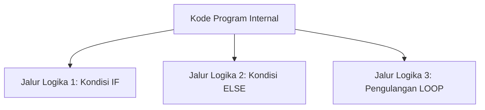
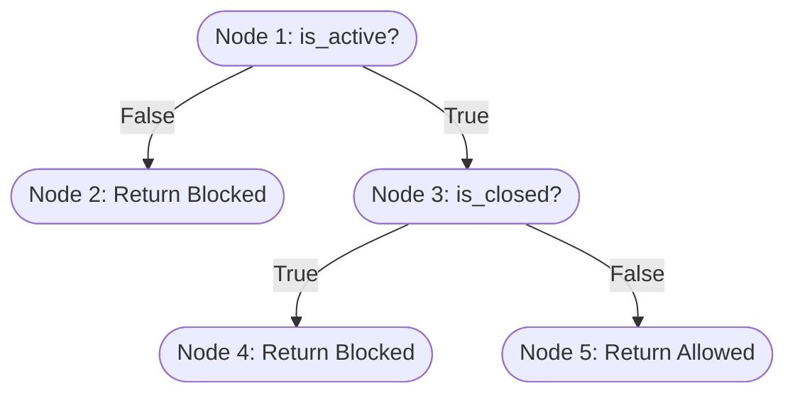

# Modul 3: White Box Testing (Pengujian Kotak Putih)

**White Box Testing** (juga dikenal sebagai *Glass Box Testing*, *Structural Testing*, atau *Clear Box Testing*) adalah metode pengujian perangkat lunak di mana struktur internal, rancangan logika, dan alur eksekusi kode program diperiksa secara langsung.

Penguji memiliki akses penuh terhadap kode sumber aplikasi dan merancang kasus uji untuk memastikan seluruh jalur logika dieksekusi dan diuji dengan benar.

---

## 🧭 1. Esensi White Box Testing

Berbeda dengan Black Box Testing yang hanya peduli pada kesesuaian input-output, White Box Testing berfokus pada **bagaimana** hasil tersebut diproses di dalam kode.



### Fokus Pengujian:
1.  **Celah Keamanan**: Memastikan tidak ada celah keamanan logic dalam struktur kode.
2.  **Jalur Logika Rusak**: Menemukan jalur logika yang tidak pernah dieksekusi (*dead code*).
3.  **Kesalahan Alur Kerja**: Memastikan variabel diinisialisasi dan digunakan dengan benar.
4.  **Penanganan Eksepsi**: Memastikan blok program penangan kesalahan (`try-catch`) berjalan saat anomali terjadi.

---

## 📊 2. Analisis Alur Kontrol & Kriteria Cakupan

Untuk melakukan pengujian White Box secara sistematis, kode program direpresentasikan ke dalam bentuk **Graf Alur Kontrol** (*Control Flow Graph* - CFG). Di dalam CFG, baris instruksi diwakili oleh **Node** (Simpul) dan alur eksekusi diwakili oleh **Edge** (Garis Penghubung).

### Kriteria Cakupan Utama:

#### A. Statement Coverage
Cakupan pernyataan mengukur persentase pernyataan (*statements*) dalam kode sumber yang dieksekusi oleh sekumpulan kasus uji.
*   **Target**: Memastikan setiap baris kode dieksekusi minimal satu kali.
*   **Kelemahan**: Teknik ini sangat lemah dalam mendeteksi percabangan kosong.

#### B. Branch / Decision Coverage
Cakupan cabang mengukur persentase hasil keputusan (kondisi benar/salah dari pernyataan `if`, `switch`, atau loop) yang dieksekusi oleh kasus uji.
*   **Target**: Memastikan setiap cabang keputusan (`true` dan `false`) dieksekusi minimal satu kali.

#### C. Path Coverage
Cakupan jalur mengukur persentase jalur unik yang dapat dilalui oleh program dari awal hingga selesai.
*   **Target**: Menguji seluruh kombinasi keputusan dalam kode.
*   **Karakteristik**: Merupakan bentuk pengujian paling komprehensif, namun sulit dilakukan pada program yang memiliki banyak percabangan kompleks atau pengulangan (*loops*).

---

## 📐 3. Konsep Kompleksitas Siklomatis (Cyclomatic Complexity)

**Cyclomatic Complexity** adalah metrik kuantitatif yang mengukur kompleksitas struktural dari suatu fungsi atau metode. Metrik ini dikembangkan oleh Thomas J. McCabe pada tahun 1976 dan digunakan untuk menentukan jumlah jalur independen yang harus diuji di dalam kode program.

### Rumus Perhitungan McCabe:
Terdapat tiga cara untuk menghitung Cyclomatic Complexity ($M$):

1.  **Menggunakan Simpul dan Garis pada CFG**:
    $$M = E - N + 2P$$
    *   $E$ = Jumlah edge (garis penghubung) dalam graf alur kontrol.
    *   $N$ = Jumlah node (simpul instruksi) dalam graf alur kontrol.
    *   $P$ = Jumlah komponen terhubung (untuk satu fungsi tunggal, nilai $P = 1$).

2.  **Menggunakan Titik Keputusan (Predicates)**:
    $$M = D + 1$$
    *   $D$ = Jumlah titik keputusan dalam kode (misalnya: `if`, `while`, `for`, `case`, `&&`, `||`).

3.  **Menggunakan Wilayah Graf (Regions)**:
    $$M = \text{Jumlah wilayah tertutup di dalam graf} + 1$$

---

## 📝 4. Ilustrasi Studi Kasus Perhitungan

Berikut adalah contoh fungsi sederhana dalam PHP untuk menentukan hak akses pengunggahan berkas proposal tugas akhir:

```php
function canUploadProposal($user, $prodi) {
    if (!$user->is_active) {             // Node 1 (Decision 1)
        return 'Blocked - User Inactive';// Node 2
    }
    
    if ($prodi->is_closed) {             // Node 3 (Decision 2)
        return 'Blocked - Period Closed';// Node 4
    }
    
    return 'Allowed';                    // Node 5
}
```

### representasi Graf Alur Kontrol (CFG):
*   **Node 1**: Pemeriksaan `if (!$user->is_active)`
*   **Node 2**: Return `'Blocked - User Inactive'`
*   **Node 3**: Pemeriksaan `if ($prodi->is_closed)`
*   **Node 4**: Return `'Blocked - Period Closed'`
*   **Node 5**: Return `'Allowed'`



### Analisis Parameter:
*   Jumlah Edge ($E$) = 4
*   Jumlah Node ($N$) = 5
*   Jumlah Komponen Terhubung ($P$) = 1
*   Jumlah Titik Keputusan ($D$) = 2 (pemeriksaan `is_active` dan `is_closed`)

### Perhitungan Kompleksitas Siklomatis (McCabe):
*   **Menggunakan Rumus Edge-Node**:
    $$M = 4 - 5 + 2(1) = 1 + 2 = 3$$
*   **Menggunakan Rumus Titik Keputusan**:
    $$M = 2 + 1 = 3$$

### Jalur Independen yang Harus Diuji (Path Coverage 100%):
Untuk menguji fungsi ini secara penuh (White Box), kita wajib menyiapkan **3 kasus uji** untuk melewati jalur independen berikut:
1.  **Jalur 1 (Node 1 -> Node 2)**: Pengguna tidak aktif (`is_active = false`).
2.  **Jalur 2 (Node 1 -> Node 3 -> Node 4)**: Pengguna aktif, tetapi periode pengajuan prodi sudah ditutup.
3.  **Jalur 3 (Node 1 -> Node 3 -> Node 5)**: Pengguna aktif dan periode pengajuan prodi masih dibuka.

> [!TIP]
> **Skor Cyclomatic Complexity** yang ideal untuk sebuah metode adalah **di bawah 10**. Jika skor melebihi 10, disarankan untuk memecah metode tersebut (*refactor*) menjadi beberapa fungsi yang lebih kecil guna mempermudah pengujian dan pemeliharaan kode.
