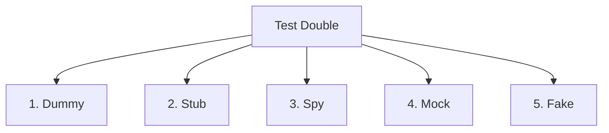

# Modul 4: Fondasi Dasar Unit Testing

**Unit Testing** adalah pilar pertama dan paling mendasar dari piramida pengujian perangkat lunak (*Software Testing Pyramid*). Unit Testing bertujuan memvalidasi kebenaran logika fungsional pada unit terkecil kode program (fungsi atau metode) secara terisolasi penuh dari komponen sistem lainnya.

---

## 🧭 1. Pentingnya Isolasi Kode

Kunci utama dari unit testing adalah **isolasi**. Sebuah tes tidak dapat diklasifikasikan sebagai Unit Test jika tes tersebut berinteraksi dengan:
*   Basis Data (Database) sesungguhnya.
*   Jaringan (Network / API HTTP Request) luar.
*   Sistem Berkas (Filesystem) lokal secara fisik.
*   Konfigurasi Server atau state sistem lain.

### Mengapa Isolasi Sangat Penting?
1.  **Kecepatan Eksekusi**: Unit Test harus berjalan sangat cepat (milidetik per tes). Ribuan unit test harus dapat selesai dijalankan dalam hitungan detik. Jika tes harus menulis data ke database fisik, eksekusi akan melambat drastis.
2.  **Isolasi Kegagalan (Locality of Defect)**: Jika unit test gagal (*fail*), pengembang harus tahu dengan pasti baris kode mana yang rusak tanpa perlu berspekulasi apakah kegagalan tersebut disebabkan oleh server database yang mati, koneksi internet lambat, atau file permission bermasalah.
3.  **Konsistensi (Determinisme)**: Tes harus memberikan hasil yang sama setiap kali dijalankan (baik dijalankan di laptop lokal pengembang maupun di server *Continuous Integration* / CI).

---

## 🎭 2. Pengenalan Dependency Injection & Test Doubles

Untuk dapat menguji sebuah fungsi secara terisolasi sementara fungsi tersebut memanggil kelas lain (dependensi), kita mengganti dependensi asli tersebut dengan objek tiruan. Istilah umum untuk objek tiruan ini adalah **Test Doubles** (seperti pemeran pengganti/stuntman dalam film).

Gerard Meszaros membagi Test Doubles menjadi 5 kategori utama:



### 1. Dummy
Objek tiruan paling sederhana yang dilewatkan ke dalam parameter fungsi hanya untuk memenuhi syarat tanda tangan metode (*method signature*), namun nilainya tidak pernah dibaca atau digunakan di dalam logika tes.
*   *Contoh*: Objek `$user` kosong yang dilewatkan ke fungsi pencatat log yang tidak kita uji di test case ini.

### 2. Stub
Objek tiruan yang memberikan jawaban / respon kalengan (*canned answers*) yang sudah ditentukan sebelumnya saat metode dipanggil selama tes berlangsung. Stub tidak peduli bagaimana atau berapa kali ia dipanggil.
*   *Contoh*: Mengatur agar objek `ExchangeRateService` tiruan selalu mengembalikan angka `16000.00` saat metode `getRate('USD')` dipanggil.

### 3. Spy
Mirip seperti Stub, namun memiliki kemampuan tambahan untuk merekam informasi aktivitas internal pemanggilannya (misal: merekam argumen apa saja yang dilewatkan, berapa kali metodenya dipanggil, dll.).
*   *Contoh*: Memeriksa apakah fungsi pengirim email tiruan benar-benar memanggil metode `send()` tepat satu kali setelah proses pembuatan user selesai.

### 4. Mock
Objek tiruan yang sangat cerdas di mana kita mendefinisikan ekspektasi perilaku terlebih dahulu (*behavior verification*). Mock akan langsung menggagalkan tes jika metode dipanggil tidak sesuai ekspektasi.
*   *Contoh*: "Saya mengekspektasikan metode `deleteSession` pada kelas `SessionManager` akan dipanggil tepat satu kali dengan argumen ID `123`. Jika tidak dipanggil dengan argumen tersebut, nyatakan tes GAGAL."

### 5. Fake
Objek tiruan yang memiliki implementasi logika kerja fungsional yang nyata, namun disederhanakan secara radikal agar tidak cocok digunakan di lingkungan produksi.
*   *Contoh*: Menggunakan **SQLite di memori (in-memory database)** atau driver driver `Storage::fake('local')` sebagai pengganti database MySQL fisik.

---

## 📐 3. Perbedaan Unit vs Integration vs Feature/E2E Testing

Tingkatan pengujian sering kali digambarkan dalam bentuk piramida untuk menunjukkan rasio jumlah tes ideal yang harus ditulis:

```
      / \
     /   \     E2E / UI Testing (Jumlah sedikit, lambat, biaya tinggi)
    /     \
   /-------\
  /         \   Integration / Feature Testing (Jumlah sedang)
 /           \
/-------------\
/               \ Unit Testing (Jumlah mayoritas, sangat cepat, murah)
/_________________\
```

| Karakteristik | Unit Testing | Integration Testing | Feature / E2E Testing |
| :--- | :--- | :--- | :--- |
| **Ruang Lingkup** | Satu fungsi atau metode terisolasi. | Interaksi antara 2 atau lebih modul (misal Service & DB). | Keseluruhan alur dari sisi pengguna (misal dari input UI hingga response). |
| **Kecepatan** | Sangat Cepat (milidetik). | Sedang (detik). | Lambat (detik hingga menit). |
| **Isolasi** | Penuh (Mocking penuh). | Parsial (DB di memori). | Tanpa isolasi (menguji seluruh stack). |
| **Kemudahan Debug**| Sangat mudah (tahu baris kode yang salah). | Sedang (perlu memeriksa beberapa modul). | Sulit (bisa disebabkan oleh frontend, backend, atau database). |
| **Tujuan Utama** | Memvalidasi logika matematika dan algoritma. | Memvalidasi relasi kueri dan pertukaran data antarmodul. | Memvalidasi pengalaman pengguna (*user flow*) dan integrasi UI. |
