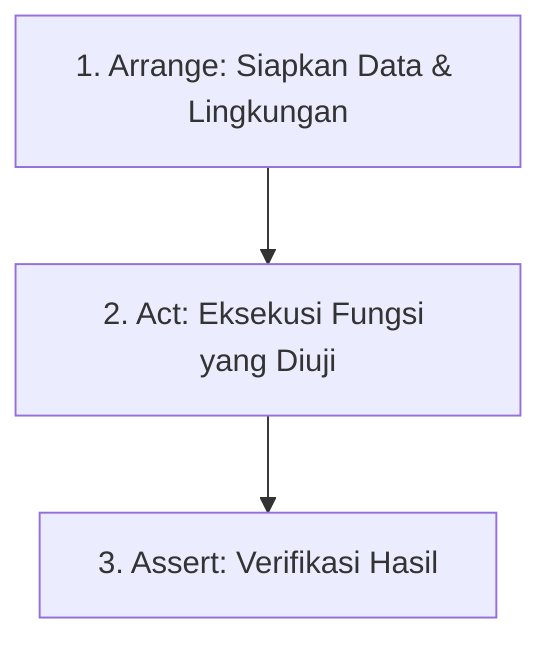

# Modul 5: Anatomi Penyusunan Unit Test

Menulis unit test yang baik memerlukan kedisiplinan dalam struktur penulisan agar mudah dibaca, dipahami, dan dipelihara oleh pengembang lain. Modul ini menjelaskan anatomi dasar penyusunan unit test.

---

## 📐 1. Pola Arrange, Act, Assert (AAA Pattern)

Pola **AAA** adalah standar industri yang membagi penulisan skenario uji ke dalam tiga bagian terpisah yang teratur secara berurutan:



### 1. Arrange (Persiapan)
Langkah pertama untuk menyiapkan prasyarat, instansiasi objek, data input dummy, dan mengonfigurasi kelakuan tiruan (*test doubles / mocks*) sebelum fungsi dieksekusi.

### 2. Act (Eksekusi)
Langkah mengeksekusi metode atau fungsi yang sedang diuji secara spesifik. Tahap ini biasanya hanya terdiri atas satu baris kode pemanggilan fungsi.

### 3. Assert (Verifikasi)
Langkah untuk memvalidasi bahwa hasil dari langkah *Act* sesuai dengan ekspektasi (output kembalian sesuai, record database berubah, atau eksepsi dilempar).

#### Contoh Penerapan Pola AAA dalam Kode Laravel PHPUnit:
```php
public function test_calculate_final_score_correctly(): void
{
    // 1. ARRANGE (Persiapan Data & Objek)
    $assessment = new Assessment();
    $criteriaScores = [
        'latar_belakang' => 80, // Bobot 40%
        'metodologi' => 90     // Bobot 60%
    ];
    $weights = [
        'latar_belakang' => 40,
        'metodologi' => 60
    ];

    // 2. ACT (Eksekusi Fungsi yang Diuji)
    $result = $assessment->calculateFinalWeightedScore($criteriaScores, $weights);

    // 3. ASSERT (Verifikasi Hasil Ekspektasi)
    // Perhitungan: (80 * 0.4) + (90 * 0.6) = 32 + 54 = 86
    $this->assertEquals(86.0, $result);
}
```

---

## 🏷️ 2. Standar Penamaan Fungsi Tes (Naming Conventions)

Nama fungsi pengujian harus bertindak sebagai **dokumentasi hidup** dari perilaku sistem. Pengembang lain harus bisa memahami apa aturan bisnis yang diuji hanya dengan membaca nama fungsi tes tersebut tanpa melihat kodenya.

### Rekomendasi Pola Penamaan:

#### Pola 1: `test_[nama_metode]_[skenario]_[ekspektasi]` (Sangat Populer)
*   `test_login_withInvalidPassword_shouldFail`
*   `test_createSubmission_whenHasActiveSubmission_throwsValidationException`

#### Pola 2: Menggunakan gaya deskriptif bahasa Inggris
*   `test_cannot_accept_submission_if_assessments_are_incomplete`
*   `test_user_is_redirected_to_login_if_unauthenticated`

#### Pola 3: Menggunakan anotasi `@test` di atas fungsi deskriptif
```php
/**
 * @test
 */
public function only_approved_submissions_are_included_in_the_report(): void
{
    // Logic test
}
```

---

## 🔍 3. Ragam Struktur Asersi (Assertion Styles)

Asersi adalah jantung dari sebuah tes. Tanpa asersi, tes hanya memverifikasi bahwa kode tidak mengalami error fatal saat dijalankan, tetapi tidak memeriksa kebenaran hasil olahan data.

### Ragam Asersi PHPUnit yang Sering Digunakan:
*   `$this->assertTrue($value)`: Memastikan nilai adalah `true`.
*   `$this->assertFalse($value)`: Memastikan nilai adalah `false`.
*   `$this->assertEquals($expected, $actual)`: Memastikan kecocokan nilai (tipe data longgar, e.g. `2` sama dengan `"2"`).
*   `$this->assertSame($expected, $actual)`: Memastikan tipe data dan nilai identik sama persis (e.g. `2` tidak sama dengan `"2"`).
*   `$this->assertNull($value)`: Memastikan nilai adalah `null`.
*   `$this->assertCount($count, $array)`: Memastikan jumlah item dalam array/koleksi sesuai.
*   `$this->assertDatabaseHas($table, $data)`: Memastikan baris data terdaftar di database (Spesifik Laravel).
*   `$this->expectException(Exception::class)`: Memastikan bahwa eksekusi kode di bawahnya melempar eksepsi kesalahan tertentu.

---

## 💾 4. Praktik Terbaik Uji Basis Data (Database Testing)

Menguji kode yang berinteraksi dengan database (seperti model Eloquent Laravel) membutuhkan perhatian khusus agar tidak mengotori database produksi dan menjaga tes tetap berjalan cepat.

### 🌟 Praktik Terbaik:

1.  **Gunakan Database Terpisah untuk Pengujian**:
    Jangan pernah menjalankan tes otomatis pada database *development* atau *production*. Konfigurasikan file `.env.testing` atau `phpunit.xml` untuk mengarahkan pengujian ke database khusus (misal: `ta_submission_test`).

2.  **Manfaatkan In-Memory Database (SQLite)**:
    Untuk kecepatan maksimum, gunakan SQLite di memori komputer sebagai database testing.
    *Di phpunit.xml:*
    ```xml
    <env name="DB_CONNECTION" value="sqlite"/>
    <env name="DB_DATABASE" value=":memory:"/>
    ```

3.  **Gunakan Transaction Rollback (RefreshDatabase)**:
    Setiap skenario uji harus berjalan pada lingkungan yang bersih. Gunakan *trait* `RefreshDatabase` di Laravel. Trait ini akan membungkus setiap tes di dalam **Database Transaction** dan melakukan *rollback* otomatis setelah tes selesai dijalankan, sehingga database kembali bersih seperti semula.
    ```php
    use Illuminate\Foundation\Testing\RefreshDatabase;

    class UserTest extends TestCase {
        use RefreshDatabase; // Rollback otomatis setelah tes selesai
    }
    ```

4.  **Gunakan Model Factories**:
    Untuk menyiapkan data awal (*Arrange*), jangan menulis kueri SQL insert manual. Gunakan *Model Factories* bawaan Laravel untuk membuat entitas tiruan secara cepat.
    ```php
    // Membuat satu user mahasiswa tiruan di database testing
    $student = User::factory()->mahasiswa()->create();
    ```
