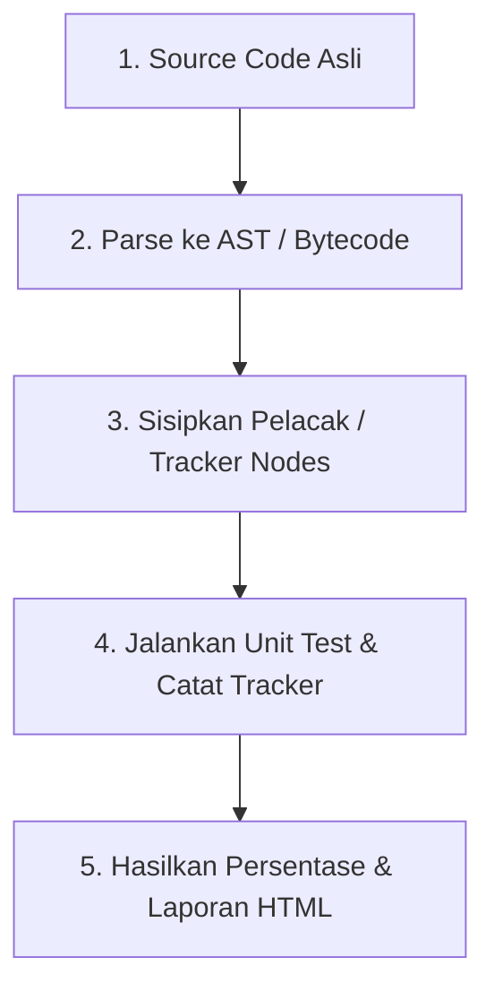

# Modul 6: Cara Perhitungan Code Coverage

*Code Coverage* (Cakupan Kode) adalah ukuran kuantitatif yang menunjukkan sejauh mana kode sumber aplikasi telah dieksekusi oleh suite pengujian otomatis. Modul ini membahas mekanisme perhitungan cakupan kode dan cara kerjanya di balik layar.

---

## ⚙️ 1. Bagaimana Alat Bantu Instrumentasi Bekerja?

Cakupan kode tidak dihitung secara manual oleh framework pengujian (seperti PHPUnit atau Jest). Perhitungan ini membutuhkan bantuan tingkat rendah (*low-level engine*) yang dipasang pada interpreter bahasa pemrograman, yang disebut **Driver Instrumentasi** (seperti **Xdebug** atau **PCOV** untuk PHP, atau **Istanbul/V8** untuk JavaScript).

### Proses Instrumentasi Berlangsung dalam 4 Tahap:



1.  **Parsing**: Driver mem-parsing kode sumber aplikasi menjadi struktur pohon sintaksis abstrak (*Abstract Syntax Tree* - AST) atau bytecode.
2.  **Penyisipan Pelacak (Instrumentation)**: Driver menyisipkan kode pelacak tersembunyi (*tracker/counter statements*) pada setiap awal baris instruksi atau titik percabangan.
3.  **Eksekusi**: Suite pengujian dijalankan. Setiap kali baris kode dilewati, *counter* pelacak baris tersebut akan bernilai $+1$.
4.  **Kompilasi Data**: Setelah seluruh tes selesai, driver mencatat baris mana saja yang memiliki nilai pelacak $\ge 1$ (dinyatakan *Covered*) dan baris dengan nilai $0$ (dinyatakan *Uncovered*).

---

## 📐 2. Perbedaan Kalkulasi: Line vs Branch vs Path Coverage

Metode kalkulasi cakupan kode menentukan tingkat kedalaman validasi pengujian:

### A. Line Coverage (Cakupan Baris)
*   **Metode**: Menghitung berapa banyak baris fisik kode program yang dieksekusi dibandingkan total baris kode keseluruhan.
*   **Karakteristik**: Paling mudah dihitung dan didukung oleh hampir semua alat pengujian, namun paling rentan memberikan rasa aman palsu (*false sense of security*).

#### Contoh Kasus:
```php
1: $result = false;
2: if ($x > 0 && $y > 0) { $result = true; }
3: return $result;
```
Jika kita menguji dengan input `$x = 5` dan `$y = 5`:
*   Baris 1 dieksekusi.
*   Baris 2 dieksekusi dan kondisi terpenuhi (`$result` diubah menjadi `true`).
*   Baris 3 dieksekusi.
*   **Hasil Line Coverage**: **100%** (3 dari 3 baris tereksekusi).

Namun, apakah tes kita sudah cukup tangguh? Bagaimana jika `$x = -5`? Logika di dalam `if` tidak akan dieksekusi, tetapi Line Coverage tetap akan melaporkan persentase tinggi jika kita hanya menguji satu kasus sukses tersebut.

### B. Branch Coverage (Cakupan Cabang)
*   **Metode**: Mengukur setiap percabangan logika keputusan (benar/salah) dalam kode program.
*   **Karakteristik**: Jauh lebih aman dibanding Line Coverage karena memaksa pengembang menguji kondisi alternatif (`true` dan `false` dari setiap `if`).

Jika kita menggunakan contoh di atas:
*   Pernyataan `if` memiliki **2 Cabang**:
    *   Cabang A: Kondisi bernilai `true` (mengeksekusi `$result = true`).
    *   Cabang B: Kondisi bernilai `false` (melewati pengubahan `$result`).
*   Jika kita hanya mengetes dengan `$x = 5` dan `$y = 5`, kita baru mengeksekusi Cabang A.
*   **Hasil Branch Coverage**: **50%** (1 dari 2 cabang tereksekusi), meskipun Line Coverage-nya melaporkan 100%.

### C. Path Coverage (Cakupan Jalur)
*   **Metode**: Mengukur seluruh kombinasi jalur unik dari awal hingga akhir fungsi.
*   **Karakteristik**: Merupakan cakupan yang paling ketat dan komprehensif.

Jika kita memiliki fungsi dengan dua `if` berurutan yang saling independen:
```php
if ($condition1) { ... }
if ($condition2) { ... }
```
*   **Line Coverage** & **Branch Coverage** hanya membutuhkan **2 kasus uji** untuk mencapai 100% (misal Uji 1: keduanya `true`, Uji 2: keduanya `false`).
*   **Path Coverage** mendeteksi adanya **4 Jalur Unik** kombinasi:
    1.  Jalur 1: `true` - `true`
    2.  Jalur 2: `true` - `false`
    3.  Jalur 3: `false` - `true`
    4.  Jalur 4: `false` - `false`
    Untuk mencapai 100% Path Coverage, kita wajib menulis **4 kasus uji**.

---

## ⚙️ 3. Driver Coverage di Ekosistem PHP

Dalam pengembangan menggunakan Laravel, terdapat dua driver populer yang digunakan untuk menghitung coverage:

### Xdebug
*   **Kelebihan**: Sangat akurat, mendukung analisis *Branch* dan *Path coverage* secara mendalam, serta bertindak sebagai alat debugging interaktif.
*   **Kekurangan**: Memiliki overhead performa yang besar, membuat eksekusi unit test melambat signifikan (bisa 2x - 5x lipat lebih lambat).

### PCOV
*   **Kelebihan**: Driver cakupan kode yang sangat ringan dan cepat. Sangat direkomendasikan untuk digunakan pada pipa integrasi berkelanjutan (*CI/CD pipelines*).
*   **Kekurangan**: Hanya berfokus pada *Line Coverage* dan tidak mendukung debugging interaktif.
