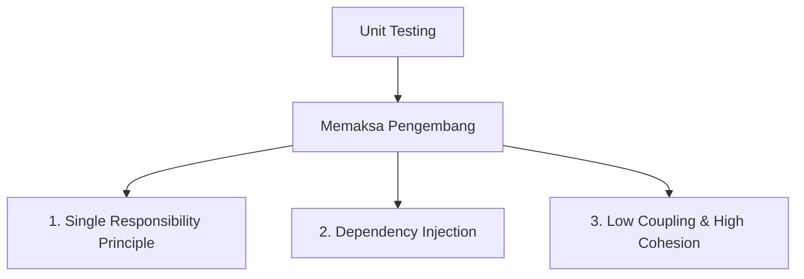

# Modul 7: Kualitas Kode, Keamanan, dan Keandalan

Pengujian perangkat lunak otomatis, khususnya unit testing, bukan hanya tentang pembuktian kebenaran matematika suatu algoritma. Terdapat hubungan kausalitas yang kuat antara penerapan unit testing dengan kualitas struktural kode (*Clean Code*), ketahanan dari bug regresi (*reliability*), dan pertahanan keamanan data (*security*).

---

## 🧼 1. Hubungan Unit Testing dengan Kualitas Kode (Clean Code)

Sebuah ungkapan terkenal di kalangan insinyur perangkat lunak berbunyi: *"Untestable code is poorly designed code"* (Kode yang tidak bisa diuji adalah kode yang dirancang dengan buruk).

Menulis unit test memaksa pengembang untuk merancang kode program agar mematuhi prinsip-prinsip **Clean Code** dan **SOLID**:

### A. Single Responsibility Principle (SRP)
Jika sebuah fungsi melakukan terlalu banyak hal (misalnya: memvalidasi input, melakukan kueri DB, menghitung nilai, dan mengirim email sekaligus), maka membuat unit test untuk fungsi tersebut akan sangat sulit. Pengembang terpaksa harus memecah fungsi besar tersebut menjadi fungsi-fungsi kecil yang terfokus (*Cohesive*) agar dapat diuji secara terisolasi.

### B. Dependency Injection (DI)
Untuk dapat menyisipkan objek tiruan (*mock objects*), kode program tidak boleh melakukan instansiasi objek dependensi secara langsung di dalam fungsi (`new Class()`). Pengembang dipaksa menggunakan pola *Dependency Injection* melalui konstruktor, yang membuat kode program menjadi sangat modular dan fleksibel.

### C. Dokumentasi yang Hidup (Living Documentation)
Uraian skenario di dalam unit test adalah penjelasan paling akurat mengenai bagaimana sistem bekerja. Berbeda dengan dokumen Word akademik yang cepat usang, unit test akan langsung melaporkan kegagalan jika perilakunya tidak lagi sinkron dengan kode aplikasi aktual.

---

## 🛡️ 2. Dampak Pengujian Terhadap Keandalan (Reliability)

Keandalan (*reliability*) sistem adalah tingkat konsistensi performa aplikasi dalam jangka waktu tertentu tanpa mengalami kegagalan operasional. Unit test berkontribusi penuh pada keandalan melalui:

### A. Pencegahan Bug Regresi (Regression Safety Net)
**Bug Regresi** adalah kembalinya kesalahan lama atau kerusakan pada fitur yang sudah stabil akibat adanya modifikasi kode program di bagian lain.
*   Ketika pengembang melakukan perubahan struktural kode (*refactoring*), memperbarui versi framework, atau optimasi kueri (eager loading), suite pengujian otomatis bertindak sebagai jaring pengaman.
*   Jika perubahan tersebut merusak logika yang sudah ada, unit test akan segera melaporkannya dalam hitungan detik sebelum perubahan tersebut diserahkan ke cabang utama (*main repository*).

### B. Desain Tangguh pada Edge Cases
Karena unit test mendorong penulisan skenario negatif (misal: input bernilai negatif, data kosong, file rusak), sistem terbiasa menangani anomali input dengan anggun tanpa memicu crash server (HTTP 500) yang merusak stabilitas lingkungan produksi.

---

## 🔒 3. Peran Pengujian dalam Keamanan Sistem (Security)

Keamanan aplikasi web modern tidak hanya bergantung pada *firewall* jaringan atau enkripsi SSL, melainkan juga harus ditegakkan pada tingkat logika aplikasi (*Application-Level Security*). Pengujian otomatis membantu mengamankan sistem melalui:

### A. Validasi Perimeter Hak Akses (RBAC Verification)
Pengujian otomatis mensimulasikan berbagai peran pengguna (*roles*) untuk memverifikasi bahwa perimeter pertahanan otorisasi tidak bocor.
*   *Contoh*: Menulis tes yang bertindak sebagai Mahasiswa dan menembak endpoint Kaprodi. Tes harus memastikan bahwa respons yang kembali adalah **403 Forbidden**. Uji otomatis ini mencegah ketidaksengajaan terbukanya hak rute admin akibat kesalahan penulisan middleware selama pemeliharaan kode jangka panjang.

### B. Pencegahan Kebocoran Data (Data Isolation Check)
Memastikan bahwa sistem membatasi kueri data berdasarkan kepemilikan program studi atau pengguna aktif (*multi-tenant isolation*). Tes otomatis dapat diprogram untuk memverifikasi bahwa kueri database selalu menyertakan klausa pembatas (misal: `where program_studi_id = $id`) untuk mencegah satu dosen mengintip data kelulusan mahasiswa prodi lain.

### C. Pencegahan Input Berbahaya
Memastikan seluruh form input divalidasi dengan ketat (mencegah karakter SQL Injection, Cross-Site Scripting / XSS, atau manipulasi ukuran berkas fisik). Uji otomatis mempermudah simulasi *fuzzing* sederhana pada parameter request untuk mendeteksi celah keamanan logika sebelum kode dideploy ke server publik.
