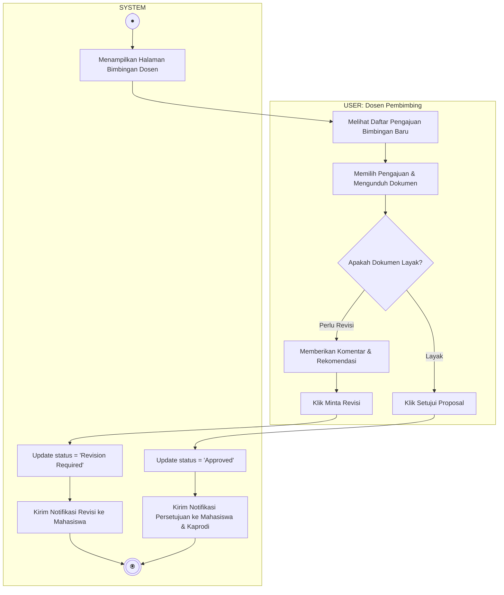

# Activity Diagram - Tinjauan Bimbingan

Diagram ini menggambarkan alur aktivitas saat Dosen Pembimbing memeriksa berkas bimbingan mahasiswa dan memberikan persetujuan atau catatan revisi, terbagi dalam dua Swimlane: **USER (Dosen)** dan **SYSTEM**.

