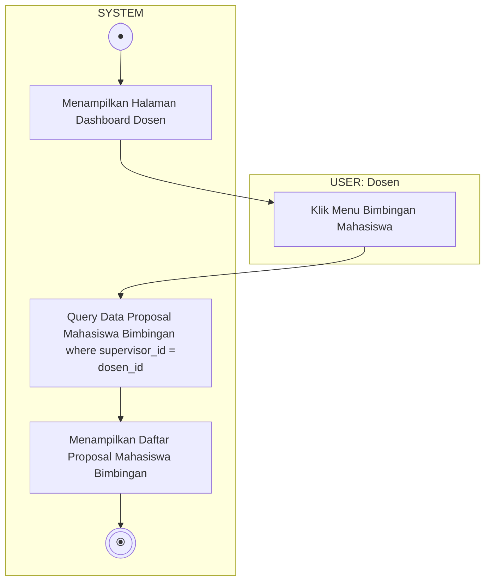

# Activity Diagram - Lihat Proposal Mahasiswa Bimbingan

Diagram ini menggambarkan alur aktivitas saat Dosen Pembimbing melihat daftar pengajuan proposal tugas akhir dari mahasiswa bimbingannya, terbagi dalam dua Swimlane: **USER (Dosen)** dan **SYSTEM**.

