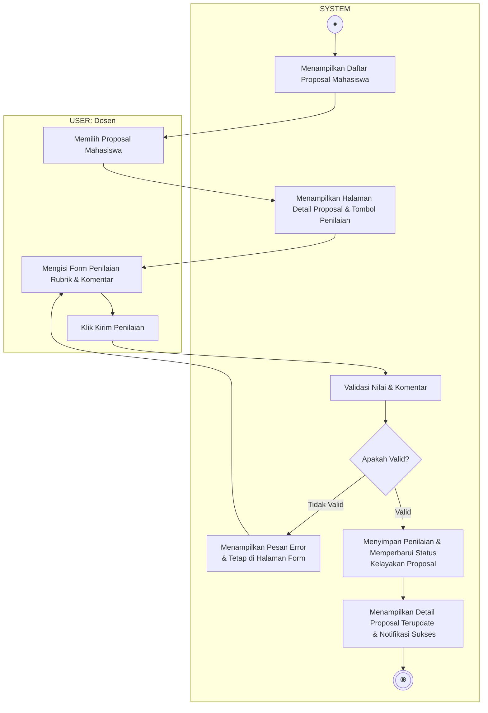

# Activity Diagram - Menilai Draft Proposal Mahasiswa

Diagram ini menggambarkan alur aktivitas saat Dosen Penguji memberikan penilaian dan komentar terhadap draft proposal tugas akhir mahasiswa bimbingan atau ujiannya, terbagi dalam dua Swimlane: **USER (Dosen)** dan **SYSTEM**.

