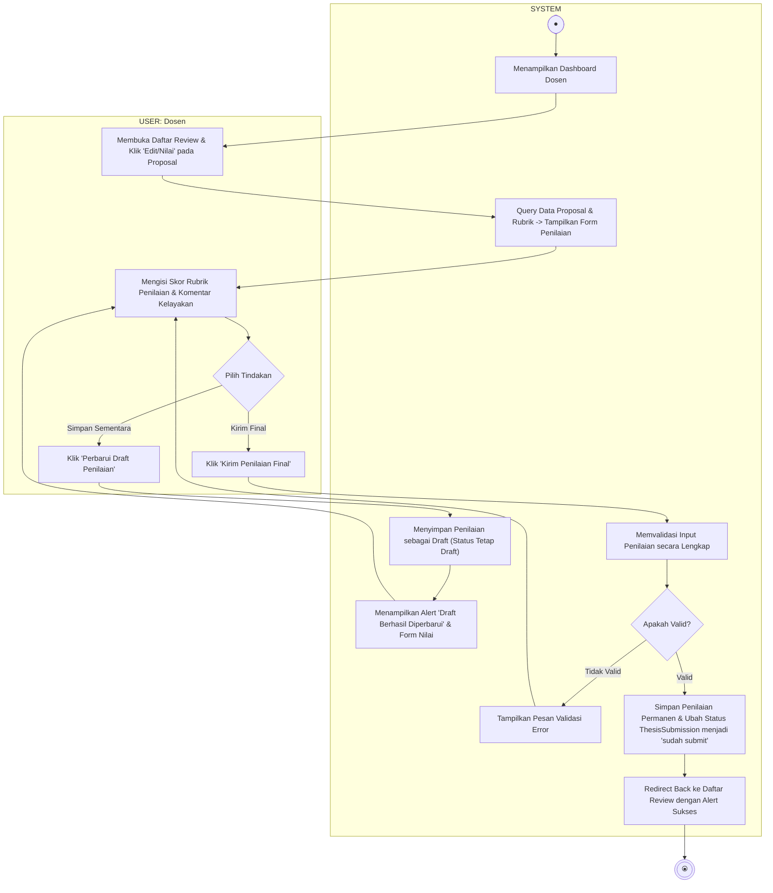

# Activity Diagram - Menilai Draft Proposal Mahasiswa

Diagram ini menggambarkan alur aktivitas saat Dosen memberikan penilaian (skor kriteria rubrik & komentar) terhadap proposal tugas akhir mahasiswa, terbagi dalam dua Swimlane: **USER (Dosen)** dan **SYSTEM**.

