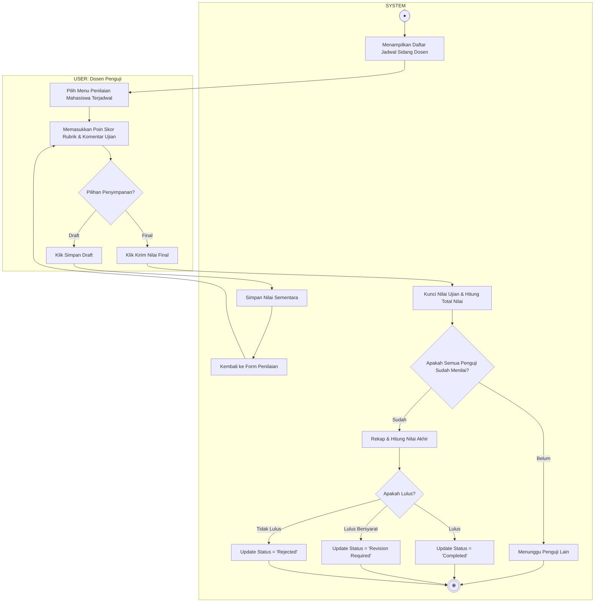

# Activity Diagram - Pelaksanaan Sidang dan Penilaian

Diagram ini menggambarkan alur aktivitas saat Dosen Penguji melaksanakan sidang dan memberikan nilai akhir ujian tugas akhir mahasiswa, terbagi dalam dua Swimlane: **USER (Dosen Penguji)** dan **SYSTEM**.

