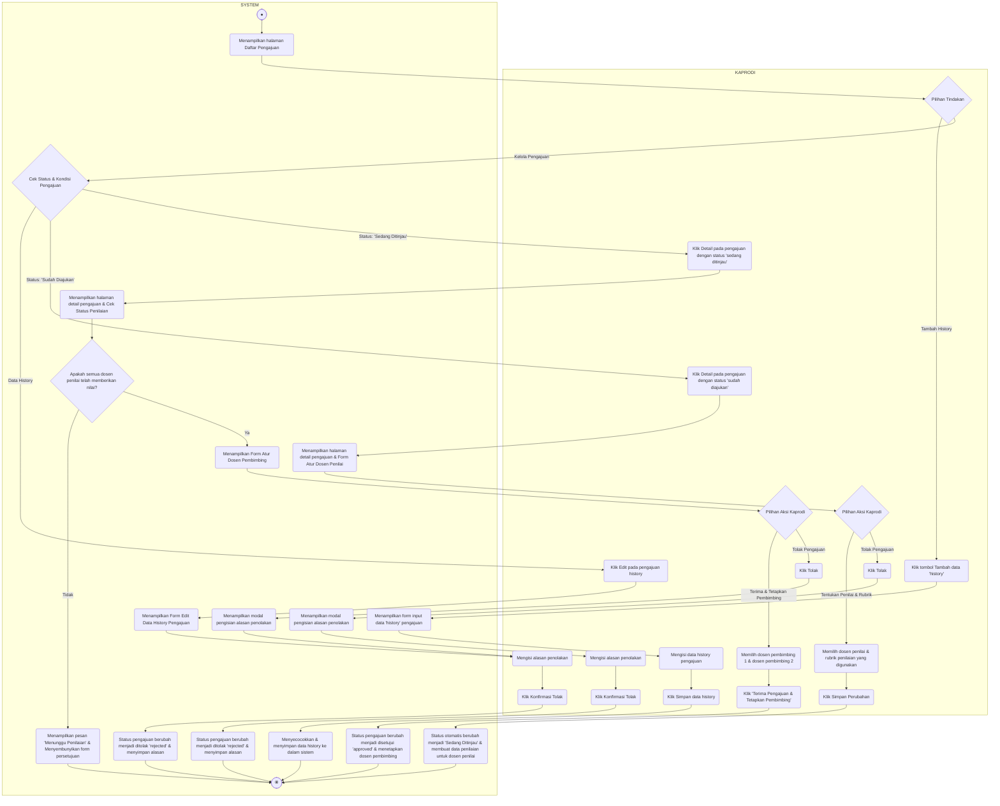

# Activity Diagram - Kelola Daftar Pengajuan

Diagram ini menggambarkan alur aktivitas saat Ketua Program Studi (Kaprodi) mengelola daftar pengajuan proposal tugas akhir mahasiswa. Penentuan tombol tindakan yang dapat diakses oleh Kaprodi dikontrol secara dinamis oleh sistem berdasarkan kondisi data dan status pengajuan aktual, khususnya pengecekan kelengkapan nilai saat status pengajuan berada di fase review (`under_review`).

