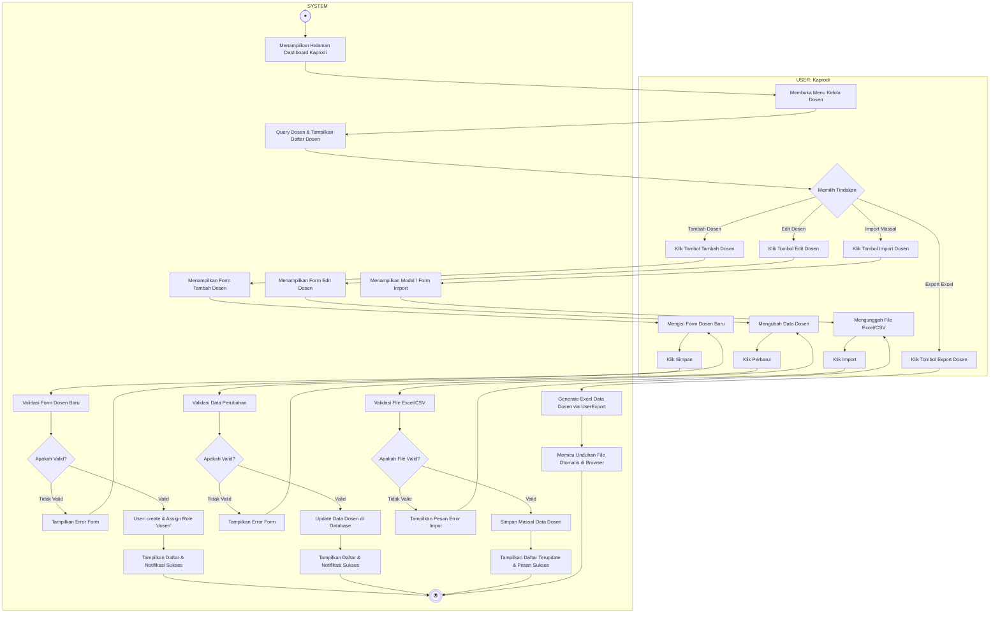

# Activity Diagram - Kelola Dosen

Diagram ini menggambarkan alur aktivitas saat Ketua Program Studi (Kaprodi) mengelola data dosen, terbagi dalam dua Swimlane: **USER (Kaprodi)** dan **SYSTEM**. Diagram ini memuat alur lengkap dari pengklikan tombol tindakan oleh user, reaksi sistem, pengisian form, validasi, hingga penyimpanan data.

