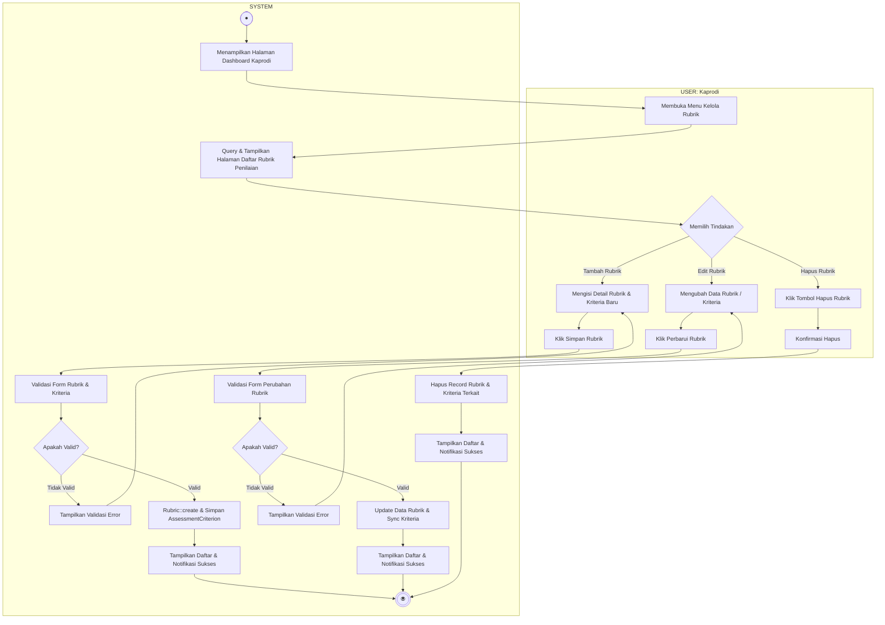

# Activity Diagram - Kelola Rubrik Penilaian

Diagram ini menggambarkan alur aktivitas saat Ketua Program Studi (Kaprodi) mengelola rubrik dan kriteria penilaian tugas akhir, terbagi dalam dua Swimlane: **USER (Kaprodi)** dan **SYSTEM**. Diagram mencakup alur melihat daftar rubrik (Read), menambah rubrik (Create), mengubah rubrik (Update), dan menghapus rubrik (Delete).

