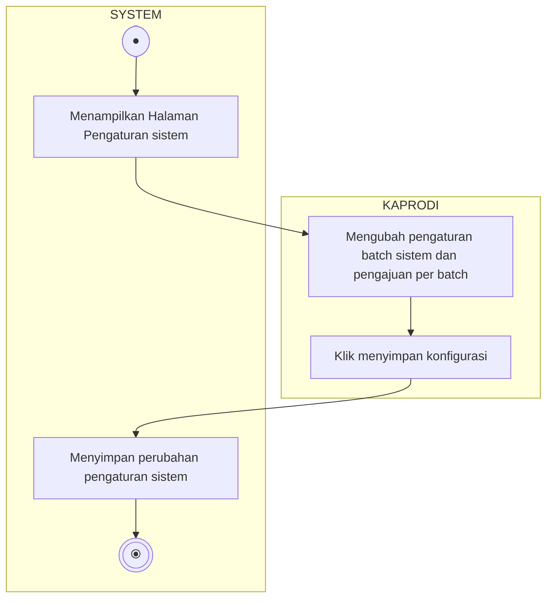

# Activity Diagram - Pengaturan TA

Diagram ini menggambarkan alur aktivitas saat Ketua Program Studi (Kaprodi) melihat dan memperbarui parameter/pengaturan tugas akhir (maksimal batch pengajuan, maksimal pengajuan per batch), terbagi dalam dua Swimlane: **KAPRODI** dan **SYSTEM**.

