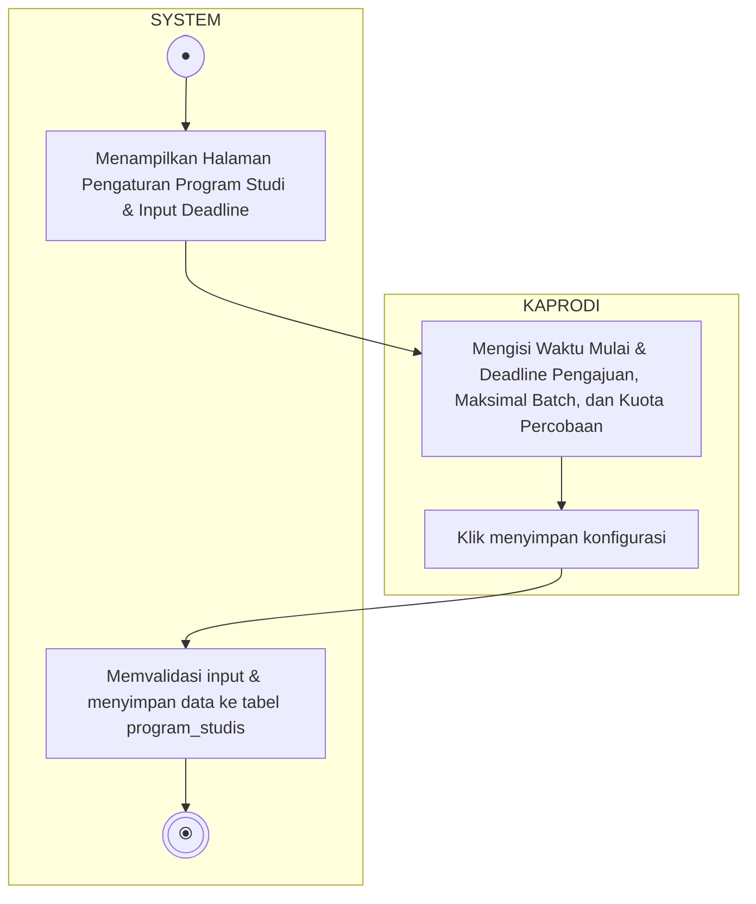

# Activity Diagram - Pengaturan TA per Program Studi

Diagram ini menggambarkan alur aktivitas saat Ketua Program Studi (Kaprodi) melihat dan memperbarui parameter/pengaturan tugas akhir (rentang tanggal deadline pengajuan, maksimal batch, kuota attempts pengajuan per batch), terbagi dalam dua Swimlane: **KAPRODI** dan **SYSTEM**.

