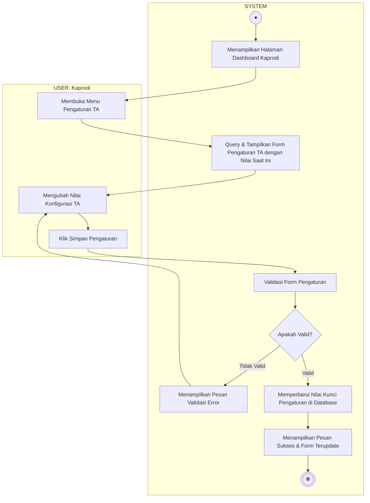

# Activity Diagram - Pengaturan TA

Diagram ini menggambarkan alur aktivitas saat Ketua Program Studi (Kaprodi) melihat dan memperbarui parameter/pengaturan tugas akhir (kuota bimbingan, batas pengajuan, format berkas, dll.), terbagi dalam dua Swimlane: **USER (Kaprodi)** dan **SYSTEM**.

