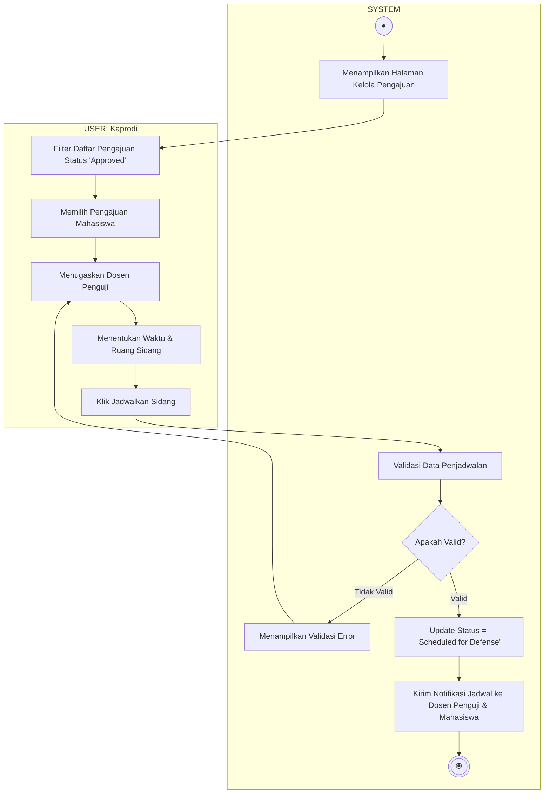

# Activity Diagram - Persiapan dan Penjadwalan Sidang

Diagram ini menggambarkan alur aktivitas saat Ketua Program Studi (Kaprodi) mempersiapkan dan menjadwalkan sidang ujian untuk pengajuan tugas akhir mahasiswa yang telah disetujui, terbagi dalam dua Swimlane: **USER (Kaprodi)** dan **SYSTEM**.

