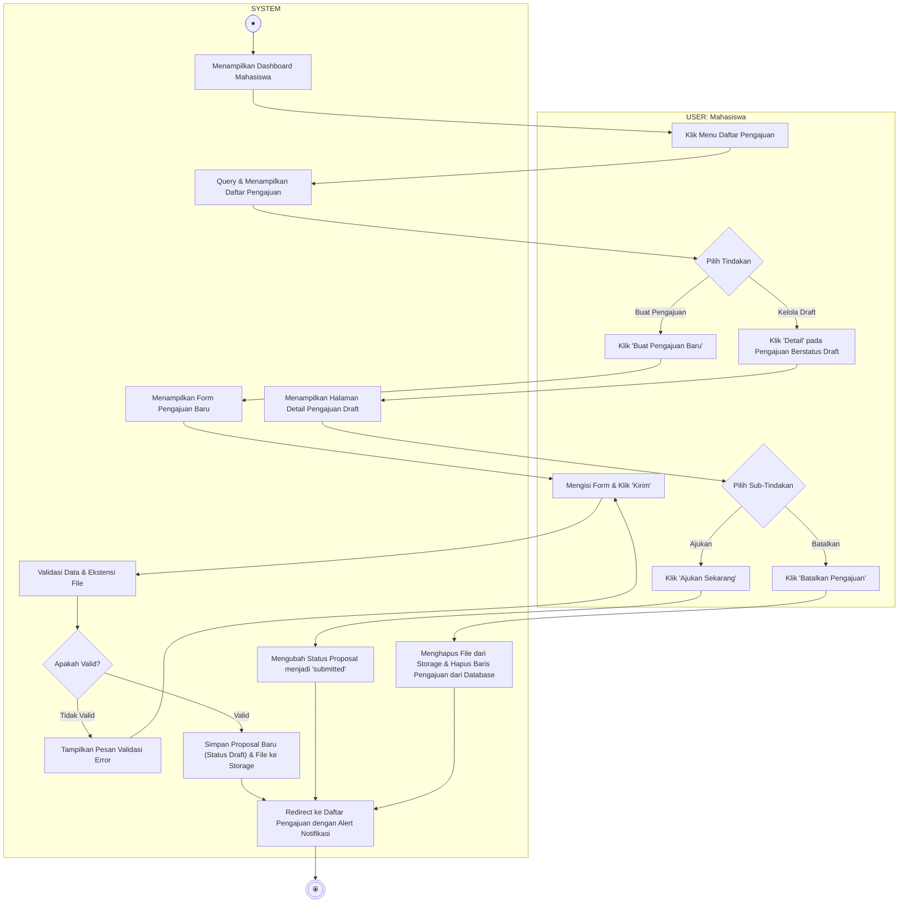

# Activity Diagram - Kelola Detail Pengajuan

Diagram ini menggambarkan alur aktivitas saat Mahasiswa mengelola atau memperbarui data dan file proposal tugas akhir mereka (baik membuat pengajuan baru atau mengelola draft detail dengan opsi ajukan/batalkan), terbagi dalam dua Swimlane: **USER (Mahasiswa)** dan **SYSTEM**.

