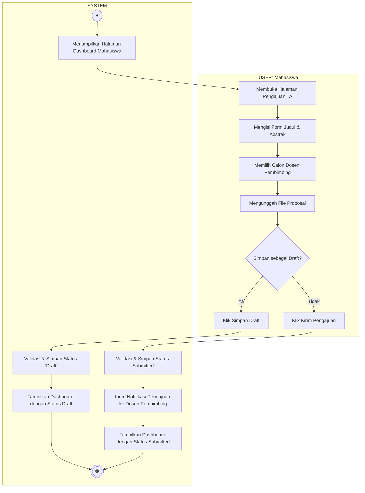

# Activity Diagram - Pengajuan Tugas Akhir (Mahasiswa)

Diagram ini menggambarkan alur aktivitas saat Mahasiswa mengisi form dan mengunggah dokumen pengajuan proposal tugas akhir baru, terbagi dalam dua Swimlane: **USER (Mahasiswa)** dan **SYSTEM**.

