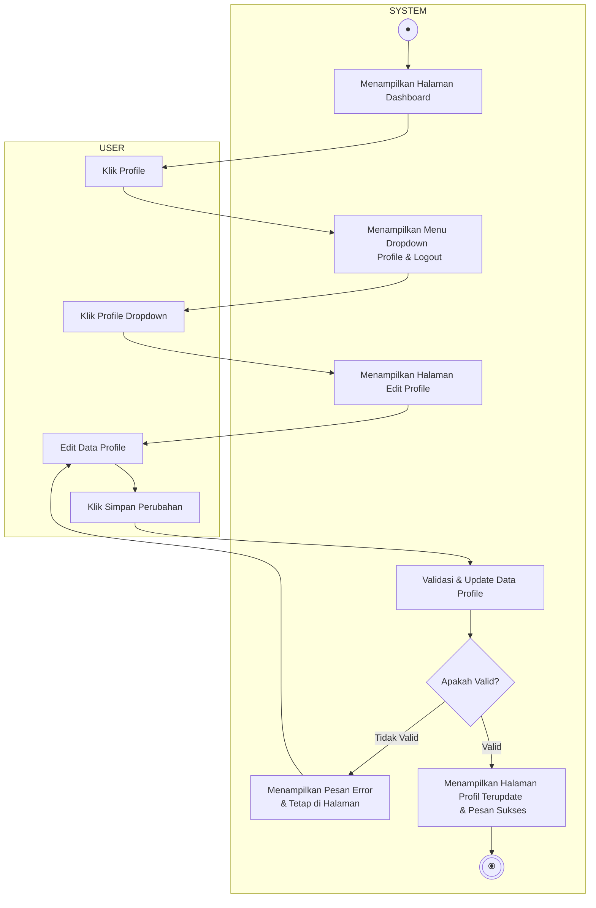

# Activity Diagram - Edit Profile

Diagram ini menggambarkan alur aktivitas proses pembaruan data profil pengguna, yang terbagi dalam dua Swimlane: **USER** dan **SYSTEM**.

```mermaid
flowchart TD
    subgraph USER [USER]
        D2[Klik Profile]
        D4[Klik Profile Dropdown]
        D6[Edit Data Profile]
        D7[Klik Simpan Perubahan]
    end

    subgraph SYSTEM [SYSTEM]
        Start([●]) --> D1[Menampilkan Halaman Dashboard]
        D1 --> D2
        D2 --> D3[Menampilkan Menu Dropdown <br/> Profile & Logout]
        D3 --> D4
        D4 --> D5[Menampilkan Halaman Edit Profile]
        D5 --> D6
        D6 --> D7
        D7 --> D8[Validasi & Update Data Profile]
        D8 --> Decision{Apakah Valid?}
        Decision -- Tidak Valid --> D9[Menampilkan Pesan Error <br/> & Tetap di Halaman]
        D9 --> D6
        Decision -- Valid --> D10[Menampilkan Halaman Profil Terupdate <br/> & Pesan Sukses]
        D10 --> End(((⦿)))
    end
```
