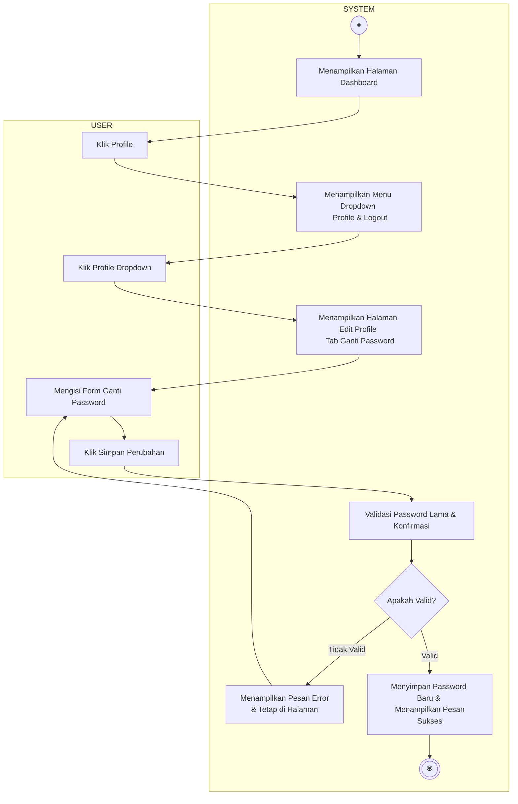

# Activity Diagram - Ganti Password

Diagram ini menggambarkan alur aktivitas proses penggantian kata sandi (password) pengguna ke dalam sistem, yang terbagi dalam dua Swimlane: **USER** dan **SYSTEM**.

