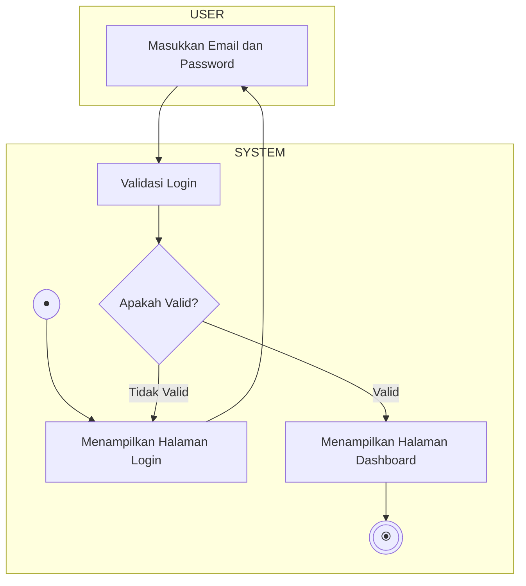

# Activity Diagram - Login

Diagram ini menggambarkan alur aktivitas proses login pengguna ke dalam sistem, yang terbagi dalam dua Swimlane: **USER** dan **SYSTEM**.

```mermaid
flowchart TD
    subgraph USER [USER]
        A2[Masukkan Email dan Password]
    end

    subgraph SYSTEM [SYSTEM]
        Start([●]) --> A1[Menampilkan Halaman Login]
        A1 --> A2
        A2 --> A3[Validasi Login]
        A3 --> Decision{Apakah Valid?}
        Decision -- Tidak Valid --> A1
        Decision -- Valid --> A4[Menampilkan Halaman Dashboard]
        A4 --> End(((⦿)))
    end
```
