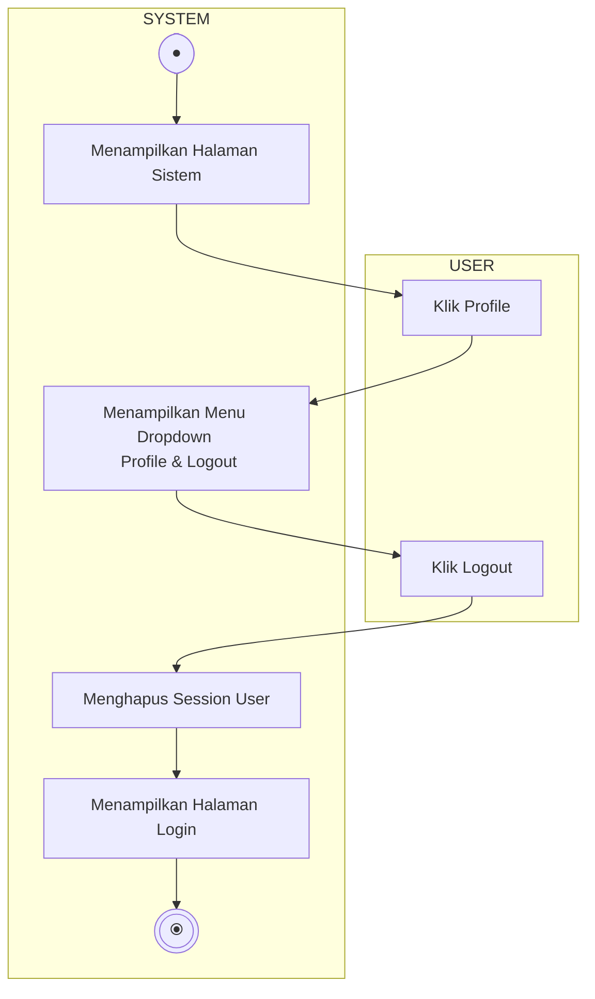

# Activity Diagram - Logout

Diagram ini menggambarkan alur aktivitas proses logout pengguna dari sistem, yang terbagi dalam dua Swimlane: **USER** dan **SYSTEM**.

```mermaid
flowchart TD
    subgraph USER [USER]
        B2[Klik Profile]
        B4[Klik Logout]
    end

    subgraph SYSTEM [SYSTEM]
        Start([●]) --> B1[Menampilkan Halaman Sistem]
        B1 --> B2
        B2 --> B3[Menampilkan Menu Dropdown <br/> Profile & Logout]
        B3 --> B4
        B4 --> B5[Menghapus Session User]
        B5 --> B6[Menampilkan Halaman Login]
        B6 --> End(((⦿)))
    end
```
