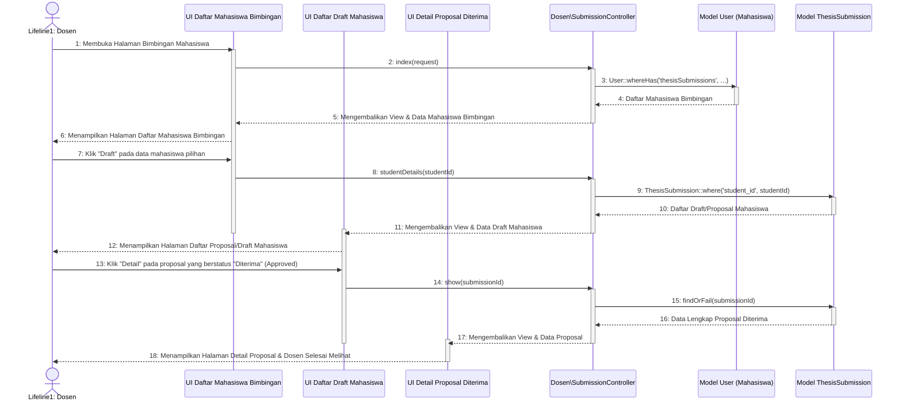

# Sequence Diagram - Lihat Proposal Mahasiswa Bimbingan

Diagram ini menunjukkan interaksi sistem saat Dosen melihat daftar pengajuan tugas akhir/proposal dari mahasiswa bimbingannya.

```mermaid
sequenceDiagram
    actor Dosen as Lifeline1: Dosen
    participant UI_Bimbingan as UI Daftar Mahasiswa Bimbingan
    participant UI_Drafts as UI Daftar Draft Mahasiswa
    participant UI_Detail as UI Detail Proposal Diterima
    participant Ctrl as Dosen\SubmissionController
    participant M_Student as Model User (Mahasiswa)
    participant M_Submission as Model ThesisSubmission

    Dosen->>UI_Bimbingan: 1: Membuka Halaman Bimbingan Mahasiswa
    activate UI_Bimbingan
    UI_Bimbingan->>Ctrl: 2: index(request)
    activate Ctrl
    Ctrl->>M_Student: 3: User::whereHas('thesisSubmissions', ...)
    activate M_Student
    M_Student-->>Ctrl: 4: Daftar Mahasiswa Bimbingan
    deactivate M_Student
    Ctrl-->>UI_Bimbingan: 5: Mengembalikan View & Data Mahasiswa Bimbingan
    deactivate Ctrl
    UI_Bimbingan-->>Dosen: 6: Menampilkan Halaman Daftar Mahasiswa Bimbingan

    %% TAHAP 2: MEMBUKA DAFTAR DRAFT MAHASISWA PILIHAN
    Dosen->>UI_Bimbingan: 7: Klik "Draft" pada data mahasiswa pilihan
    UI_Bimbingan->>Ctrl: 8: studentDetails(studentId)
    activate Ctrl
    Ctrl->>M_Submission: 9: ThesisSubmission::where('student_id', studentId)
    activate M_Submission
    M_Submission-->>Ctrl: 10: Daftar Draft/Proposal Mahasiswa
    deactivate M_Submission
    Ctrl-->>UI_Drafts: 11: Mengembalikan View & Data Draft Mahasiswa
    deactivate Ctrl
    activate UI_Drafts
    deactivate UI_Bimbingan
    UI_Drafts-->>Dosen: 12: Menampilkan Halaman Daftar Proposal/Draft Mahasiswa

    %% TAHAP 3: MELIHAT DETAIL PROPOSAL DITERIMA
    Dosen->>UI_Drafts: 13: Klik "Detail" pada proposal yang berstatus "Diterima" (Approved)
    UI_Drafts->>Ctrl: 14: show(submissionId)
    activate Ctrl
    Ctrl->>M_Submission: 15: findOrFail(submissionId)
    activate M_Submission
    M_Submission-->>Ctrl: 16: Data Lengkap Proposal Diterima
    deactivate M_Submission
    Ctrl-->>UI_Detail: 17: Mengembalikan View & Data Proposal
    deactivate Ctrl
    activate UI_Detail
    deactivate UI_Drafts
    UI_Detail-->>Dosen: 18: Menampilkan Halaman Detail Proposal & Dosen Selesai Melihat
    deactivate UI_Detail
```
