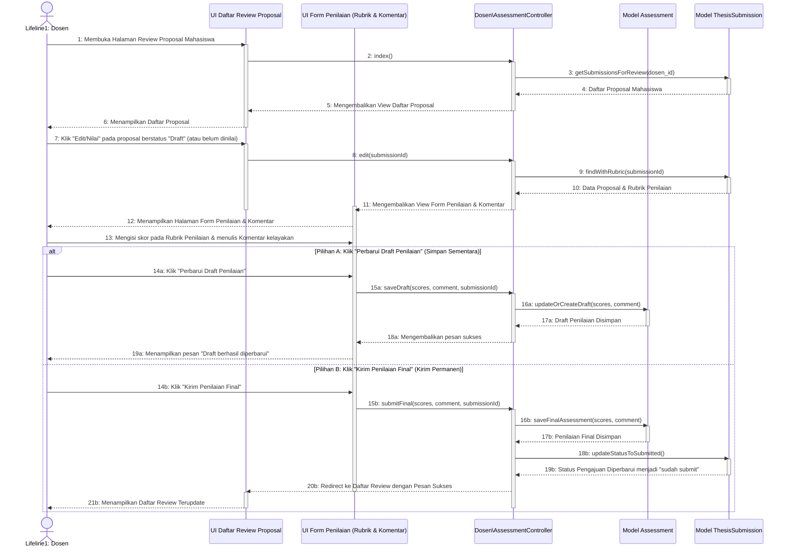

# Sequence Diagram - Menilai Draft Proposal Mahasiswa

Diagram ini menunjukkan interaksi sistem saat Dosen memberikan penilaian (skor kriteria rubrik & komentar kelayakan) pada draft proposal tugas akhir mahasiswa.

