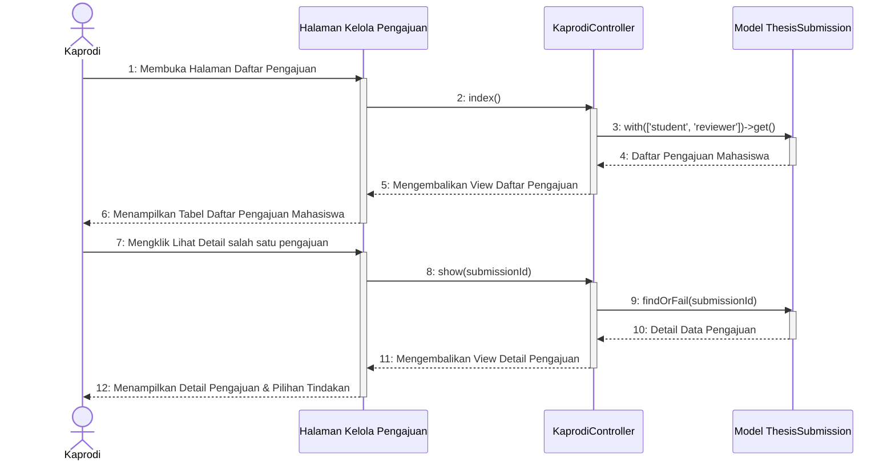

# Sequence Diagram - Kelola Daftar Pengajuan (Utama)

Diagram utama ini menggambarkan alur membuka daftar pengajuan dan melihat detail pengajuan tugas akhir oleh Ketua Program Studi (Kaprodi). Tindakan spesifik berdasarkan kondisi/jenis pengajuan dipecah menjadi sub-diagram modular berikut untuk menghilangkan kerumitan blok percabangan:

### 📜 Daftar Sub-Diagram Berdasarkan Kondisi & Aksi
1. **Mengelola Data Riwayat (History)**
   * **[Aksi: Tambah Data Riwayat]** [Tambah Data Riwayat](file:///opt/lampp/htdocs/ta_submission/docs/uml/Sequence%20Diagram/Kaprodi/Kelola%20Daftar%20Pengajuan/sequence_diagram_kelola_daftar_pengajuan_riwayat_tambah.md) - Menambahkan riwayat skripsi mahasiswa terdahulu secara mandiri.
   * **[Aksi: Edit Data Riwayat]** [Edit Data Riwayat](file:///opt/lampp/htdocs/ta_submission/docs/uml/Sequence%20Diagram/Kaprodi/Kelola%20Daftar%20Pengajuan/sequence_diagram_kelola_daftar_pengajuan_riwayat_edit.md) - Mengubah rincian riwayat skripsi yang sudah terdaftar.
2. **Mengelola Pengajuan Reguler Baru (Status: Sudah Diajukan)**
   * **[Aksi: Atur Penilai]** [Atur Dosen Penilai & Rubrik](file:///opt/lampp/htdocs/ta_submission/docs/uml/Sequence%20Diagram/Kaprodi/Kelola%20Daftar%20Pengajuan/sequence_diagram_kelola_daftar_pengajuan_atur_penilai.md) - Memilih dosen penguji dan rubrik penilaian untuk memulai proses review.
   * **[Aksi: Tolak Awal]** [Tolak Pengajuan Awal](file:///opt/lampp/htdocs/ta_submission/docs/uml/Sequence%20Diagram/Kaprodi/Kelola%20Daftar%20Pengajuan/sequence_diagram_kelola_daftar_pengajuan_tolak_awal.md) - Menolak langsung berkas proposal di awal sebelum dinilai.
3. **Mengelola Pengajuan Reguler Sedang Berjalan (Status: Sedang Ditinjau)**
   * **[Kondisi: Menunggu]** [Pantau Progres Penilaian](file:///opt/lampp/htdocs/ta_submission/docs/uml/Sequence%20Diagram/Kaprodi/Kelola%20Daftar%20Pengajuan/sequence_diagram_kelola_daftar_pengajuan_pantau_nilai.md) - Memantau status penilaian dari dosen penguji yang belum selesai.
   * **[Aksi: Terima]** [Terima Pengajuan & Atur Pembimbing](file:///opt/lampp/htdocs/ta_submission/docs/uml/Sequence%20Diagram/Kaprodi/Kelola%20Daftar%20Pengajuan/sequence_diagram_kelola_daftar_pengajuan_terima.md) - Menyetujui kelulusan proposal dan menetapkan dosen pembimbing 1 & 2.
   * **[Aksi: Tolak Akhir]** [Tolak Hasil Ujian](file:///opt/lampp/htdocs/ta_submission/docs/uml/Sequence%20Diagram/Kaprodi/Kelola%20Daftar%20Pengajuan/sequence_diagram_kelola_daftar_pengajuan_tolak_akhir.md) - Menolak pengajuan reguler berdasarkan hasil ujian/review dari dosen penguji.

---

## 🎬 Diagram Utama: Akses Daftar & Detail

> [!NOTE]
> Pilih alur sub-diagram spesifik di atas sesuai dengan tipe berkas dan status tindakan yang diinginkan.
