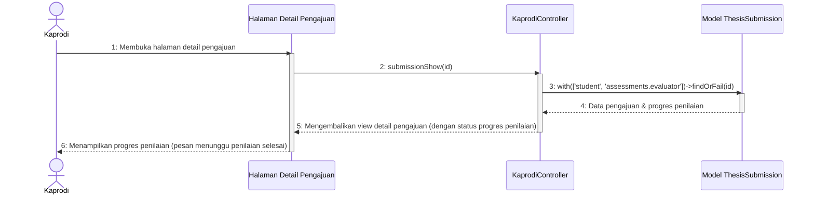

# Sequence Diagram - Pantau Progres Penilaian

Diagram ini menggambarkan alur Ketua Program Studi (Kaprodi) saat memantau progres penilaian berkas yang berstatus **"Sedang Ditinjau"** di mana masih ada dosen penilai yang belum selesai menginput nilai mereka.

Kembali ke **[Diagram Utama Kelola Daftar Pengajuan](file:///opt/lampp/htdocs/ta_submission/docs/uml/Sequence%20Diagram/Kaprodi/Kelola%20Daftar%20Pengajuan/sequence_diagram_kelola_daftar_pengajuan.md)**.

---

## 🎬 Diagram: Memantau Progres Penilaian

