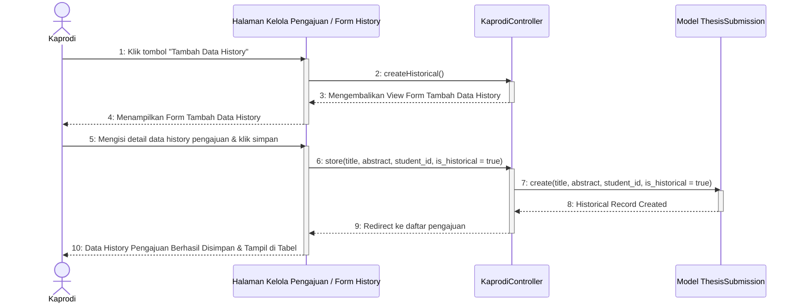

# Sequence Diagram - Tambah Data Riwayat

Diagram ini menggambarkan alur tindakan mandiri Ketua Program Studi (Kaprodi) saat menambahkan data riwayat (historical data) skripsi/tugas akhir mahasiswa terdahulu ke dalam sistem.

Kembali ke **[Diagram Utama Kelola Daftar Pengajuan](file:///opt/lampp/htdocs/ta_submission/docs/uml/Sequence%20Diagram/Kaprodi/Kelola%20Daftar%20Pengajuan/sequence_diagram_kelola_daftar_pengajuan.md)**.

---

## 🎬 Diagram: Tambah Data Riwayat Mandiri

