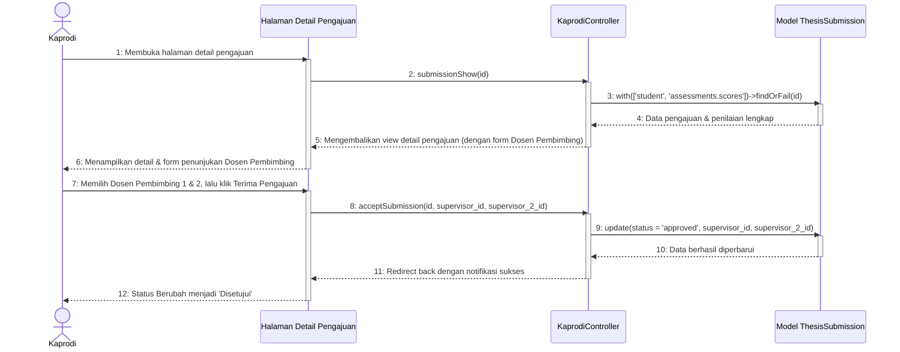

# Sequence Diagram - Terima Pengajuan & Atur Pembimbing

Diagram ini menggambarkan alur Ketua Program Studi (Kaprodi) saat menyetujui proposal tugas akhir mahasiswa setelah seluruh dosen penilai selesai memberikan nilai ujian, serta menetapkan Dosen Pembimbing 1 dan Dosen Pembimbing 2 aktif.

Kembali ke **[Diagram Utama Kelola Daftar Pengajuan](file:///opt/lampp/htdocs/ta_submission/docs/uml/Sequence%20Diagram/Kaprodi/Kelola%20Daftar%20Pengajuan/sequence_diagram_kelola_daftar_pengajuan.md)**.

---

## 🎬 Diagram: Menerima Pengajuan & Menetapkan Pembimbing

