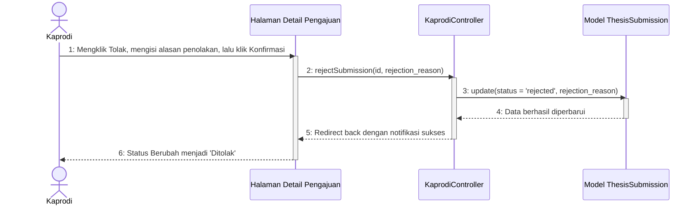

# Sequence Diagram - Tolak Pengajuan Awal

Diagram ini menggambarkan alur Ketua Program Studi (Kaprodi) saat memutuskan untuk menolak langsung berkas pengajuan reguler mahasiswa di awal (status **"Sudah Diajukan"**), misalnya karena berkas tidak memenuhi kelengkapan administratif.

Kembali ke **[Diagram Utama Kelola Daftar Pengajuan](file:///opt/lampp/htdocs/ta_submission/docs/uml/Sequence%20Diagram/Kaprodi/Kelola%20Daftar%20Pengajuan/sequence_diagram_kelola_daftar_pengajuan.md)**.

---

## 🎬 Diagram: Menolak Pengajuan Awal

