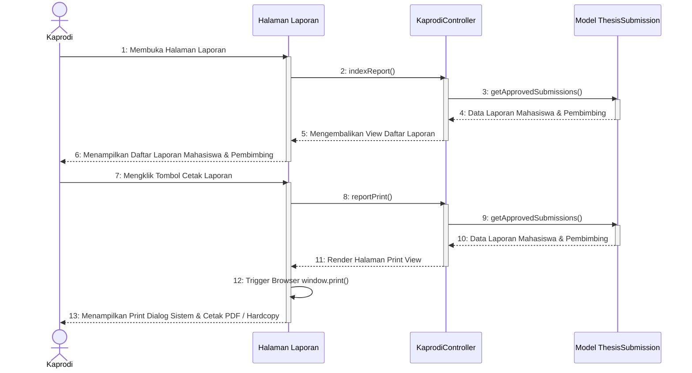

# Sequence Diagram - Cetak Laporan Pengajuan Proposal

Diagram ini menunjukkan interaksi sistem saat Ketua Program Studi (Kaprodi) mencetak laporan seluruh pengajuan proposal tugas akhir mahasiswa yang telah disetujui (Approved) beserta pembimbingnya melalui fitur print preview browser.

