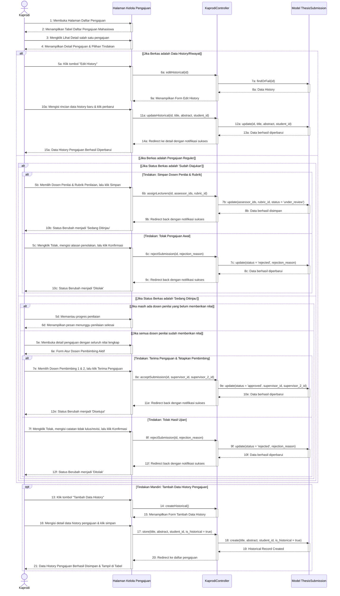

# Sequence Diagram - Kelola Daftar Pengajuan

Diagram ini menggambarkan interaksi sistem saat Ketua Program Studi (Kaprodi) mengelola daftar pengajuan proposal tugas akhir mahasiswa.

```mermaid
sequenceDiagram
    actor Kaprodi as Kaprodi
    participant UI as Halaman Kelola Pengajuan
    participant Ctrl as KaprodiController
    participant Model as Model ThesisSubmission

    %% 1. VIEW LIST OF SUBMISSIONS
    Kaprodi->>UI: 1: Membuka Halaman Daftar Pengajuan
    activate UI
    UI-->>Kaprodi: 2: Menampilkan Tabel Daftar Pengajuan Mahasiswa
    deactivate UI

    %% 2. VIEW DETAILED SUBMISSION
    Kaprodi->>UI: 3: Mengklik Lihat Detail salah satu pengajuan
    activate UI
    UI-->>Kaprodi: 4: Menampilkan Detail Pengajuan & Pilihan Tindakan
    deactivate UI

    %% CONDITIONAL FLOW BASED ON STATE
    alt [Jika Berkas adalah Data History/Riwayat]
        
        Kaprodi->>UI: 5a: Klik tombol "Edit History"
        activate UI
        UI->>Ctrl: 6a: editHistorical(id)
        activate Ctrl
        Ctrl->>Model: 7a: findOrFail(id)
        activate Model
        Model-->>Ctrl: 8a: Data History
        deactivate Model
        Ctrl-->>UI: 9a: Menampilkan Form Edit History
        deactivate Ctrl
        deactivate UI

        Kaprodi->>UI: 10a: Mengisi rincian data history baru & klik perbarui
        activate UI
        UI->>Ctrl: 11a: updateHistorical(id, title, abstract, student_id)
        activate Ctrl
        Ctrl->>Model: 12a: update(id, title, abstract, student_id)
        activate Model
        Model-->>Ctrl: 13a: Data berhasil diperbarui
        deactivate Model
        Ctrl-->>UI: 14a: Redirect ke detail dengan notifikasi sukses
        deactivate Ctrl
        UI-->>Kaprodi: 15a: Data History Pengajuan Berhasil Diperbarui
        deactivate UI

    else [Jika Berkas adalah Pengajuan Reguler]
        
        alt [Jika Status Berkas adalah 'Sudah Diajukan']
            
            alt Tindakan: Simpan Dosen Penilai & Rubrik
                Kaprodi->>UI: 5b: Memilih Dosen Penilai & Rubrik Penilaian, lalu klik Simpan
                activate UI
                UI->>Ctrl: 6b: assignLecturers(id, assessor_ids, rubric_id)
                activate Ctrl
                Ctrl->>Model: 7b: update(assessor_ids, rubric_id, status = 'under_review')
                activate Model
                Model-->>Ctrl: 8b: Data berhasil disimpan
                deactivate Model
                Ctrl-->>UI: 9b: Redirect back dengan notifikasi sukses
                deactivate Ctrl
                UI-->>Kaprodi: 10b: Status Berubah menjadi 'Sedang Ditinjau'
                deactivate UI
                
            else Tindakan: Tolak Pengajuan Awal
                Kaprodi->>UI: 5c: Mengklik Tolak, mengisi alasan penolakan, lalu klik Konfirmasi
                activate UI
                UI->>Ctrl: 6c: rejectSubmission(id, rejection_reason)
                activate Ctrl
                Ctrl->>Model: 7c: update(status = 'rejected', rejection_reason)
                activate Model
                Model-->>Ctrl: 8c: Data berhasil diperbarui
                deactivate Model
                Ctrl-->>UI: 9c: Redirect back dengan notifikasi sukses
                deactivate Ctrl
                UI-->>Kaprodi: 10c: Status Berubah menjadi 'Ditolak'
                deactivate UI
            end

        else [Jika Status Berkas adalah 'Sedang Ditinjau']
            
            alt [Jika masih ada dosen penilai yang belum memberikan nilai]
                Kaprodi->>UI: 5d: Memantau progres penilaian
                activate UI
                UI-->>Kaprodi: 6d: Menampilkan pesan menunggu penilaian selesai
                deactivate UI

            else [Jika semua dosen penilai sudah memberikan nilai]
                Kaprodi->>UI: 5e: Membuka detail pengajuan dengan seluruh nilai lengkap
                activate UI
                UI-->>Kaprodi: 6e: Form Atur Dosen Pembimbing Aktif
                deactivate UI
                
                alt Tindakan: Terima Pengajuan & Tetapkan Pembimbing
                    Kaprodi->>UI: 7e: Memilih Dosen Pembimbing 1 & 2, lalu klik Terima Pengajuan
                    activate UI
                    UI->>Ctrl: 8e: acceptSubmission(id, supervisor_id, supervisor_2_id)
                    activate Ctrl
                    Ctrl->>Model: 9e: update(status = 'approved', supervisor_id, supervisor_2_id)
                    activate Model
                    Model-->>Ctrl: 10e: Data berhasil diperbarui
                    deactivate Model
                    Ctrl-->>UI: 11e: Redirect back dengan notifikasi sukses
                    deactivate Ctrl
                    UI-->>Kaprodi: 12e: Status Berubah menjadi 'Disetujui'
                    deactivate UI
                    
                else Tindakan: Tolak Hasil Ujian
                    Kaprodi->>UI: 7f: Mengklik Tolak, mengisi catatan tidak lulus/revisi, lalu klik Konfirmasi
                    activate UI
                    UI->>Ctrl: 8f: rejectSubmission(id, rejection_reason)
                    activate Ctrl
                    Ctrl->>Model: 9f: update(status = 'rejected', rejection_reason)
                    activate Model
                    Model-->>Ctrl: 10f: Data berhasil diperbarui
                    deactivate Model
                    Ctrl-->>UI: 11f: Redirect back dengan notifikasi sukses
                    deactivate Ctrl
                    UI-->>Kaprodi: 12f: Status Berubah menjadi 'Ditolak'
                    deactivate UI
                end
            end
        end
    end

    %% 3. INDEPENDENT ACTION: ADD HISTORICAL DATA
    opt Tindakan Mandiri: Tambah Data History Pengajuan
        Kaprodi->>UI: 13: Klik tombol "Tambah Data History"
        activate UI
        UI->>Ctrl: 14: createHistorical()
        activate Ctrl
        Ctrl-->>UI: 15: Menampilkan Form Tambah Data History
        deactivate Ctrl
        deactivate UI

        Kaprodi->>UI: 16: Mengisi detail data history pengajuan & klik simpan
        activate UI
        UI->>Ctrl: 17: store(title, abstract, student_id, is_historical = true)
        activate Ctrl
        Ctrl->>Model: 18: create(title, abstract, student_id, is_historical = true)
        activate Model
        Model-->>Ctrl: 19: Historical Record Created
        deactivate Model
        Ctrl-->>UI: 20: Redirect ke daftar pengajuan
        deactivate Ctrl
        UI-->>Kaprodi: 21: Data History Pengajuan Berhasil Disimpan & Tampil di Tabel
        deactivate UI
    end
```
