# Sequence Diagram - Kelola Daftar Pengajuan

Diagram ini menggambarkan interaksi sistem saat Ketua Program Studi (Kaprodi) mengelola daftar pengajuan proposal tugas akhir mahasiswa, diselaraskan secara presisi dengan berkas `KaprodiController.php`, `KaprodiService.php`, dan logika antarmuka `show.blade.php`. Setiap proses digambarkan menggunakan pesan aktif (*messages*) antar-objek untuk memenuhi standar UML akademik yang ketat tanpa menggunakan elemen catatan (*notes*), serta menggunakan bahasa label yang mudah dipahami.

```mermaid
sequenceDiagram
    actor Kaprodi as Lifeline1: Kaprodi
    participant UI as UI Kelola Pengajuan Page
    participant Ctrl as Kaprodi\KaprodiController
    participant Svc as KaprodiService
    participant M_Submission as Model ThesisSubmission

    %% 1. VIEW LIST OF SUBMISSIONS
    Kaprodi->>UI: 1: Membuka Halaman Daftar Pengajuan
    activate UI
    UI->>Ctrl: 2: submissions(Request)
    activate Ctrl
    Ctrl->>Svc: 3: getAllSubmissions(), getLecturers(), getRubrics()
    activate Svc
    Svc->>M_Submission: 4: Query submissions with student & details
    activate M_Submission
    M_Submission-->>Svc: 5: Data Submissions & Dosen/Rubrik
    deactivate M_Submission
    Svc-->>Ctrl: 6: Data compact()
    deactivate Svc
    Ctrl-->>UI: 7: Render kaprodi.submissions.index
    deactivate Ctrl
    UI-->>Kaprodi: 8: Menampilkan Tabel Daftar Pengajuan Mahasiswa
    deactivate UI

    %% 2. VIEW DETAILED SUBMISSION WITH STATE CONDITIONS
    Kaprodi->>UI: 9: Mengklik Lihat Detail salah satu pengajuan
    activate UI
    UI->>Ctrl: 10: submissionShow(Request, id)
    activate Ctrl
    Ctrl->>M_Submission: 11: ThesisSubmission::with([...])->findOrFail(id)
    activate M_Submission
    M_Submission-->>Ctrl: 12: Data Detail Submission
    deactivate M_Submission
    Ctrl-->>UI: 13: Render kaprodi.submissions.show
    deactivate Ctrl
    UI-->>Kaprodi: 14: Menampilkan Detail Pengajuan & Pilihan Tindakan
    deactivate UI

    %% CONDITIONAL FLOW BASED ON STATE
    alt [Jika Berkas adalah Data History/Riwayat]
        
        %% Edit Historical Data
        Kaprodi->>UI: 15a: Mengubah rincian data history pengajuan & klik perbarui
        activate UI
        UI->>Ctrl: 16a: updateHistorical(Request, id)
        activate Ctrl
        Ctrl->>Ctrl: 17a: Validasi data history (student_id, title, abstract, dll.)
        Ctrl->>Svc: 18a: updateHistoricalSubmission(id, validatedData)
        activate Svc
        Svc->>M_Submission: 19a: Update historical record
        activate M_Submission
        M_Submission-->>Svc: 20a: Update Success
        deactivate M_Submission
        Svc-->>Ctrl: 21a: Success
        deactivate Svc
        Ctrl-->>UI: 22a: Redirect ke detail dengan notifikasi sukses
        deactivate Ctrl
        UI-->>Kaprodi: 23a: Data History Pengajuan Berhasil Diperbarui
        deactivate UI

    else [Jika Berkas adalah Pengajuan Reguler]
        
        alt [Jika Status Berkas adalah 'Sudah Diajukan']
            
            alt Tindakan: Simpan Dosen Penilai & Rubrik
                Kaprodi->>UI: 15b: Memilih Dosen Penilai & Rubrik Penilaian, lalu klik Simpan
                activate UI
                UI->>Ctrl: 16b: assignLecturers(KaprodiAssignLecturersRequest, id)
                activate Ctrl
                Ctrl->>Ctrl: 17b: Validasi assessor_ids & rubric_id
                Ctrl->>Svc: 18b: assignLecturers(id, validatedData)
                activate Svc
                Svc->>M_Submission: 19b: Simpan Penilai/Rubrik & ubah status ke 'under_review'
                activate M_Submission
                M_Submission-->>Svc: 20b: Update Success
                deactivate M_Submission
                Svc-->>Ctrl: 21b: Success
                deactivate Svc
                Ctrl-->>UI: 22b: Redirect back() dengan notifikasi sukses
                deactivate Ctrl
                UI-->>Kaprodi: 23b: Status Berubah menjadi 'Sedang Ditinjau'
                deactivate UI
                
            else Tindakan: Tolak Pengajuan Awal
                Kaprodi->>UI: 15c: Mengklik Tolak, mengisi alasan penolakan, lalu klik Konfirmasi
                activate UI
                UI->>Ctrl: 16c: rejectSubmission(Request, id)
                activate Ctrl
                Ctrl->>Ctrl: 17c: Validasi rejection_reason tidak boleh kosong
                Ctrl->>Svc: 18c: rejectSubmission(id, validatedData)
                activate Svc
                Svc->>M_Submission: 19c: Update status to 'rejected' & simpan alasan penolakan
                activate M_Submission
                M_Submission-->>Svc: 20c: Update Success
                deactivate M_Submission
                Svc-->>Ctrl: 21c: Success
                deactivate Svc
                Ctrl-->>UI: 22c: Redirect back() dengan notifikasi sukses
                deactivate Ctrl
                UI-->>Kaprodi: 23c: Status Berubah menjadi 'Ditolak'
                deactivate UI
            end

        else [Jika Status Berkas adalah 'Sedang Ditinjau']
            
            alt [Jika masih ada dosen penilai yang belum memberikan nilai]
                Kaprodi->>UI: 15d: Memantau progres penilaian (Form persetujuan tidak dapat diakses)
                activate UI
                UI->>UI: 16d: Sembunyikan form pembimbing & tampilkan status 'Menunggu Penilaian'
                UI-->>Kaprodi: 17d: Menampilkan pesan menunggu penilaian selesai
                deactivate UI

            else [Jika semua dosen penilai sudah memberikan nilai]
                Kaprodi->>UI: 15e: Membuka detail pengajuan dengan seluruh nilai lengkap
                activate UI
                UI->>UI: 16e: Menampilkan Form Atur Dosen Pembimbing secara otomatis
                UI-->>Kaprodi: 17e: Form Atur Dosen Pembimbing Aktif
                deactivate UI
                
                alt Tindakan: Terima Pengajuan & Tetapkan Pembimbing
                    Kaprodi->>UI: 18e: Memilih Dosen Pembimbing 1 & 2, lalu klik Terima Pengajuan
                    activate UI
                    UI->>Ctrl: 19e: acceptSubmission(Request, id)
                    activate Ctrl
                    Ctrl->>Ctrl: 20e: Validasi supervisor_id & supervisor_2_id
                    Ctrl->>Svc: 21e: acceptSubmission(id, validatedData)
                    activate Svc
                    Svc->>M_Submission: 22e: Update status to 'approved' & simpan ID pembimbing
                    activate M_Submission
                    M_Submission-->>Svc: 23e: Update Success
                    deactivate M_Submission
                    Svc-->>Ctrl: 24e: Success
                    deactivate Svc
                    Ctrl-->>UI: 25e: Redirect back() dengan notifikasi sukses
                    deactivate Ctrl
                    UI-->>Kaprodi: 26e: Status Berubah menjadi 'Disetujui'
                    deactivate UI
                    
                else Tindakan: Tolak Hasil Ujian
                    Kaprodi->>UI: 18f: Mengklik Tolak, mengisi catatan tidak lulus/revisi, lalu klik Konfirmasi
                    activate UI
                    UI->>Ctrl: 19f: rejectSubmission(Request, id)
                    activate Ctrl
                    Ctrl->>Ctrl: 20f: Validasi rejection_reason tidak boleh kosong
                    Ctrl->>Svc: 21f: rejectSubmission(id, validatedData)
                    activate Svc
                    Svc->>M_Submission: 22f: Update status to 'rejected' & simpan catatan kegagalan
                    activate M_Submission
                    M_Submission-->>Svc: 23f: Update Success
                    deactivate M_Submission
                    Svc-->>Ctrl: 24f: Success
                    deactivate Svc
                    Ctrl-->>UI: 25f: Redirect back() dengan notifikasi sukses
                    deactivate Ctrl
                    UI-->>Kaprodi: 26f: Status Berubah menjadi 'Ditolak'
                    deactivate UI
                end
            end
        end
    end

    %% 3. INDEPENDENT ACTION: ADD HISTORICAL DATA
    opt Tindakan Mandiri: Tambah Data History Pengajuan
        Kaprodi->>UI: 27: Membuka Form Tambah History & Mengisi Form Pengajuan
        activate UI
        UI->>Ctrl: 28: store(Request)
        activate Ctrl
        Ctrl->>Ctrl: 29: Validasi field form data history pengajuan
        Ctrl->>Svc: 30: createHistoricalSubmission(validatedData)
        activate Svc
        Svc->>M_Submission: 31: ThesisSubmission::create() dengan is_historical = true
        activate M_Submission
        M_Submission-->>Svc: 32: Historical Record Created
        deactivate M_Submission
        Svc-->>Ctrl: 33: Success
        deactivate Svc
        Ctrl-->>UI: 34: Redirect route('kaprodi.submissions.index')
        deactivate Ctrl
        UI-->>Kaprodi: 35: Data History Pengajuan Berhasil Disimpan & Tampil di Tabel
        deactivate UI
    end
```

