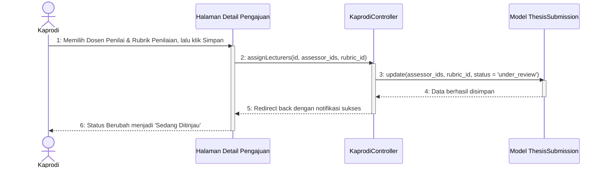

# Sequence Diagram - Atur Dosen Penilai & Rubrik

Diagram ini menggambarkan alur Ketua Program Studi (Kaprodi) saat menetapkan dosen penilai (penguji) dan rubrik penilaian untuk berkas pengajuan reguler mahasiswa baru (status **"Sudah Diajukan"**), yang menandai dimulainya proses review berkas.

Kembali ke **[Diagram Utama Kelola Daftar Pengajuan](file:///opt/lampp/htdocs/ta_submission/docs/uml/Sequence%20Diagram/Kaprodi/sequence_diagram_kelola_daftar_pengajuan.md)**.

---

## 🎬 Diagram: Menetapkan Dosen Penilai & Rubrik

