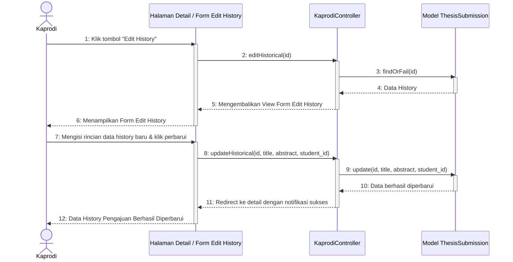

# Sequence Diagram - Edit Data Riwayat

Diagram ini menggambarkan alur tindakan Ketua Program Studi (Kaprodi) saat melakukan pengubahan (edit) pada data riwayat (historical data) skripsi/tugas akhir mahasiswa yang sudah ada di dalam sistem.

Kembali ke **[Diagram Utama Kelola Daftar Pengajuan](file:///opt/lampp/htdocs/ta_submission/docs/uml/Sequence%20Diagram/Kaprodi/sequence_diagram_kelola_daftar_pengajuan.md)**.

---

## 🎬 Diagram: Edit Data Riwayat

