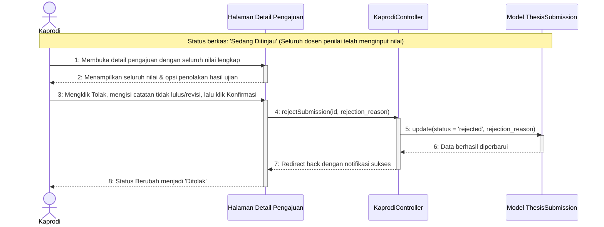

# Sequence Diagram - Tolak Hasil Ujian

Diagram ini menggambarkan alur Ketua Program Studi (Kaprodi) saat memutuskan untuk menolak kelulusan/ujian proposal mahasiswa berdasarkan hasil penilaian ujian yang diinput oleh dosen penguji/penilai (status berkas saat ini **"Sedang Ditinjau"**).

Kembali ke **[Diagram Utama Kelola Daftar Pengajuan](file:///opt/lampp/htdocs/ta_submission/docs/uml/Sequence%20Diagram/Kaprodi/sequence_diagram_kelola_daftar_pengajuan.md)**.

---

## 🎬 Diagram: Menolak Hasil Ujian Proposal

