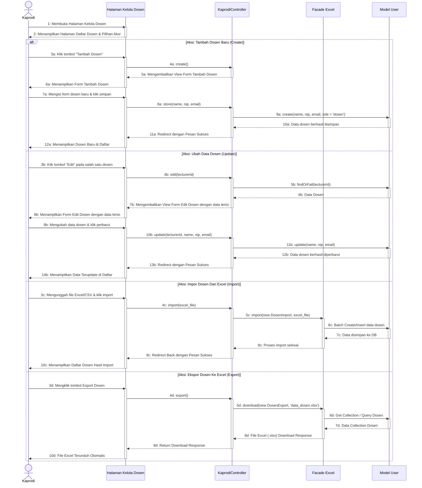

# Sequence Diagram - Kelola Dosen (Read, Create, Update, Import, Export)

Diagram ini menunjukkan interaksi sistem saat Ketua Program Studi (Kaprodi) mengelola data dosen, meliputi proses melihat daftar & detail (Read), tambah (Create), edit (Update), impor massal dari file (Import), dan ekspor data ke Excel (Export).

