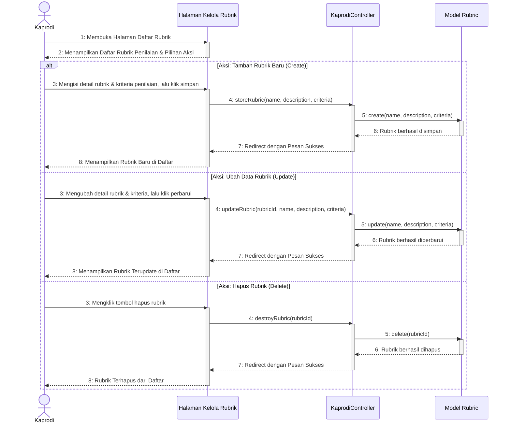

# Sequence Diagram - Kelola Rubrik Penilaian (Read, Create, Update, Delete)

Diagram ini menunjukkan interaksi sistem saat Ketua Program Studi (Kaprodi) mengelola rubrik penilaian dan kriteria evaluasi tugas akhir, meliputi proses melihat daftar rubrik (Read), penambahan rubrik baru (Create), pembaruan data rubrik (Update), dan penghapusan rubrik (Delete).

