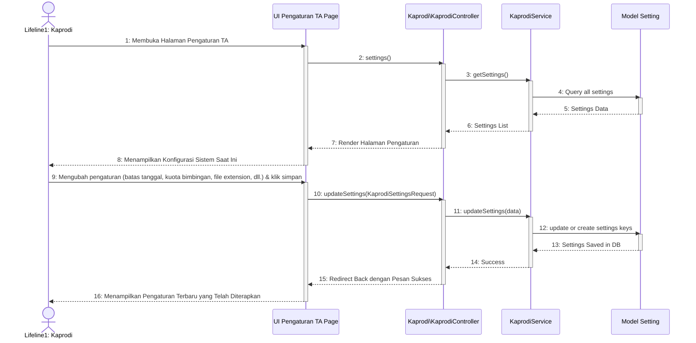

# Sequence Diagram - Pengaturan TA

Diagram ini menunjukkan interaksi sistem saat Ketua Program Studi (Kaprodi) melihat dan memperbarui konfigurasi atau pengaturan tugas akhir program studi (misalnya batas tanggal pengajuan, format dokumen, limit revisi, dll.).

