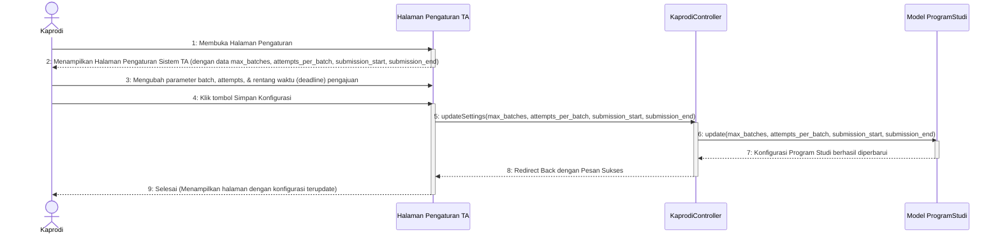

# Sequence Diagram - Pengaturan TA

Diagram ini menunjukkan interaksi sistem saat Ketua Program Studi (Kaprodi) melihat dan memperbarui konfigurasi atau pengaturan tugas akhir program studi (maksimal batch pengajuan, maksimal pengajuan per batch).

