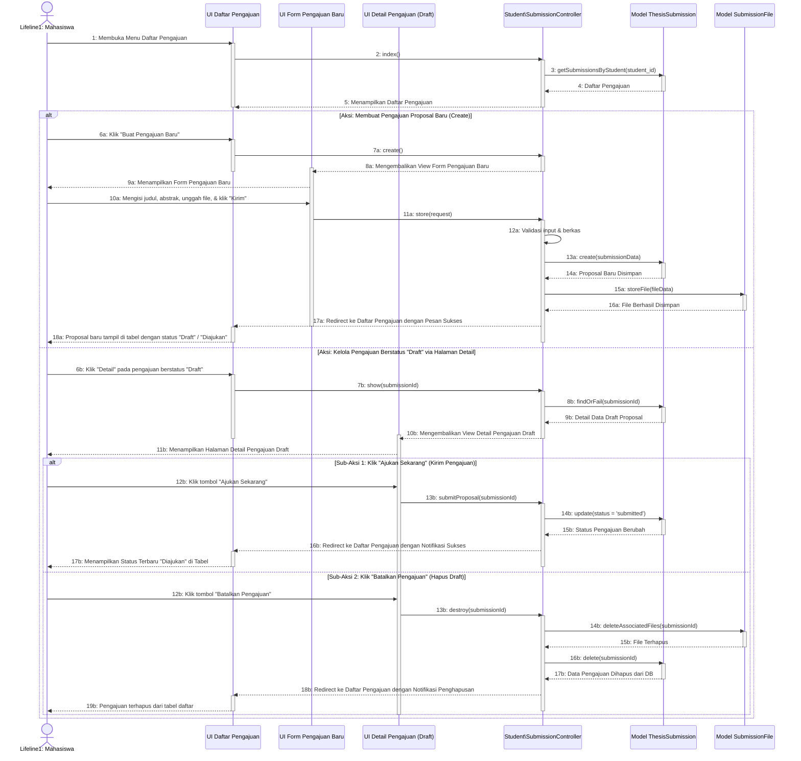

# Sequence Diagram - Kelola Detail Pengajuan

Diagram ini menunjukkan interaksi sistem saat Mahasiswa memperbarui atau mengelola detail pengajuan tugas akhir/proposal mereka (misalnya memperbarui judul, abstrak, atau mengunggah ulang file proposal).

