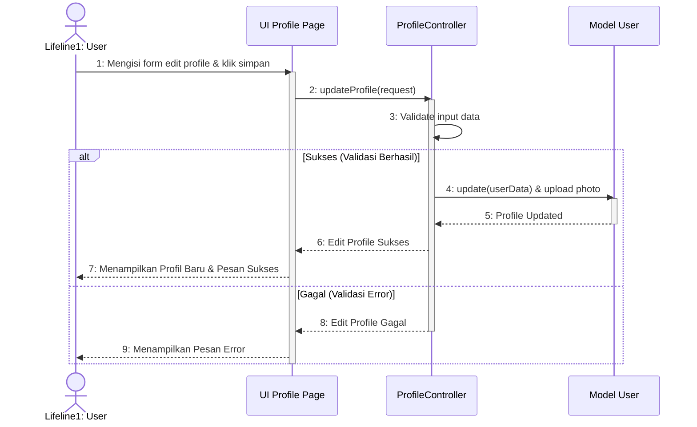

# Sequence Diagram - Edit Profile

Diagram ini menunjukkan interaksi sistem saat pengguna (User) memperbarui informasi profil mereka.

```mermaid
sequenceDiagram
    actor User as Lifeline1: User
    participant UI as UI Profile Page
    participant Ctrl as ProfileController
    participant Model as Model User

    User->>UI: 1: Mengisi form edit profile & klik simpan
    activate UI
    UI->>Ctrl: 2: updateProfile(request)
    activate Ctrl
    Ctrl->>Ctrl: 3: Validate input data
    
    alt Sukses (Validasi Berhasil)
        Ctrl->>Model: 4: update(userData) & upload photo
        activate Model
        Model-->>Ctrl: 5: Profile Updated
        deactivate Model
        Ctrl-->>UI: 6: Edit Profile Sukses
        UI-->>User: 7: Menampilkan Profil Baru & Pesan Sukses
    else Gagal (Validasi Error)
        Ctrl-->>UI: 8: Edit Profile Gagal
        deactivate Ctrl
        UI-->>User: 9: Menampilkan Pesan Error
    end
    deactivate UI
```
