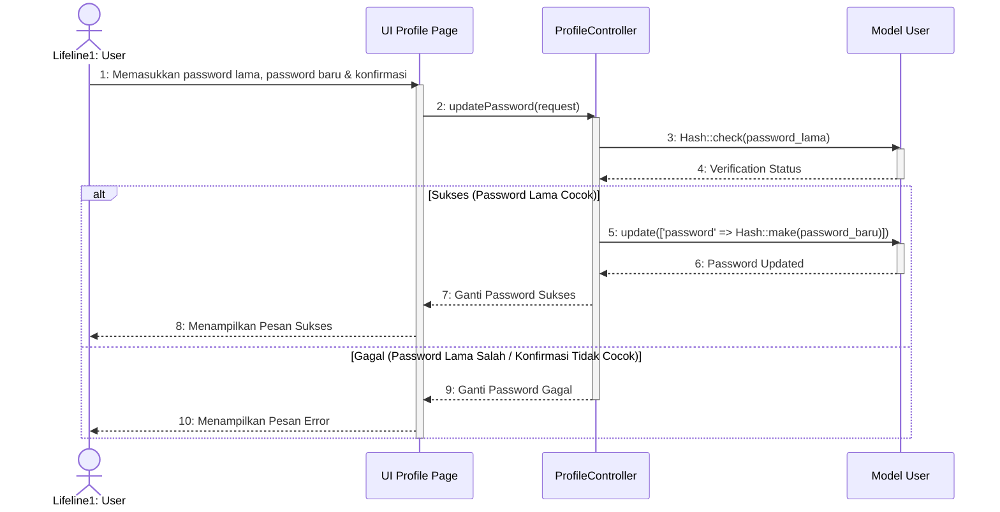

# Sequence Diagram - Ganti Password

Diagram ini menunjukkan interaksi sistem saat pengguna (User) mengganti kata sandi/password mereka.

```mermaid
sequenceDiagram
    actor User as Lifeline1: User
    participant UI as UI Profile Page
    participant Ctrl as ProfileController
    participant Model as Model User

    User->>UI: 1: Memasukkan password lama, password baru & konfirmasi
    activate UI
    UI->>Ctrl: 2: updatePassword(request)
    activate Ctrl
    Ctrl->>Model: 3: Hash::check(password_lama)
    activate Model
    Model-->>Ctrl: 4: Verification Status
    deactivate Model

    alt Sukses (Password Lama Cocok)
        Ctrl->>Model: 5: update(['password' => Hash::make(password_baru)])
        activate Model
        Model-->>Ctrl: 6: Password Updated
        deactivate Model
        Ctrl-->>UI: 7: Ganti Password Sukses
        UI-->>User: 8: Menampilkan Pesan Sukses
    else Gagal (Password Lama Salah / Konfirmasi Tidak Cocok)
        Ctrl-->>UI: 9: Ganti Password Gagal
        deactivate Ctrl
        UI-->>User: 10: Menampilkan Pesan Error
    end
    deactivate UI
```
