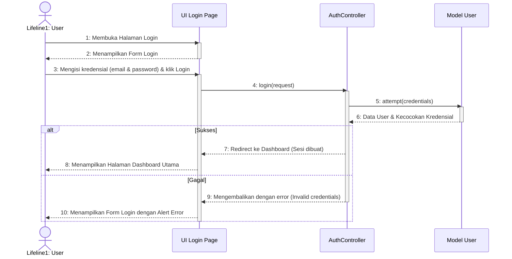

# Sequence Diagram - Login

Diagram ini menunjukkan interaksi sistem saat pengguna (User) melakukan proses login ke dalam aplikasi pengajuan tugas akhir.

```mermaid
sequenceDiagram
    actor User as Lifeline1: User
    participant UI as UI Login Page
    participant Ctrl as AuthController
    participant Model as Model User

    User->>UI: 1: Membuka Halaman Login
    activate UI
    UI-->>User: 2: Menampilkan Form Login
    deactivate UI

    User->>UI: 3: Mengisi kredensial (email & password) & klik Login
    activate UI
    UI->>Ctrl: 4: login(request)
    activate Ctrl
    Ctrl->>Model: 5: attempt(credentials)
    activate Model
    Model-->>Ctrl: 6: Data User & Kecocokan Kredensial
    deactivate Model
    
    alt Sukses
        Ctrl-->>UI: 7: Redirect ke Dashboard (Sesi dibuat)
        UI-->>User: 8: Menampilkan Halaman Dashboard Utama
    else Gagal
        Ctrl-->>UI: 9: Mengembalikan dengan error (Invalid credentials)
        deactivate Ctrl
        UI-->>User: 10: Menampilkan Form Login dengan Alert Error
    end
    deactivate UI
```
