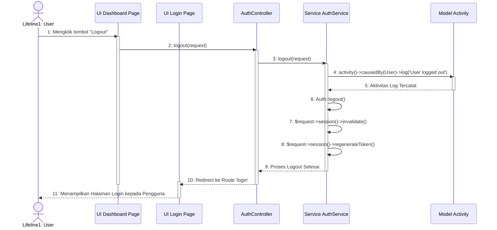

# Sequence Diagram - Logout

Diagram ini menunjukkan interaksi sistem saat pengguna (User) melakukan proses logout dari aplikasi.

```mermaid
sequenceDiagram
    actor User as Lifeline1: User
    participant UI_Dash as UI Dashboard Page
    participant UI_Login as UI Login Page
    participant Ctrl as AuthController
    participant S_Auth as Service AuthService
    participant M_Activity as Model Activity

    User->>UI_Dash: 1: Mengklik tombol "Logout"
    activate UI_Dash
    UI_Dash->>Ctrl: 2: logout(request)
    activate Ctrl
    
    Ctrl->>S_Auth: 3: logout(request)
    activate S_Auth
    
    %% Inside Service
    S_Auth->>M_Activity: 4: activity()->causedBy(User)->log('User logged out')
    activate M_Activity
    M_Activity-->>S_Auth: 5: Aktivitas Log Tercatat
    deactivate M_Activity
    
    S_Auth->>S_Auth: 6: Auth::logout()
    S_Auth->>S_Auth: 7: $request->session()->invalidate()
    S_Auth->>S_Auth: 8: $request->session()->regenerateToken()
    
    S_Auth-->>Ctrl: 9: Proses Logout Selesai
    deactivate S_Auth
    
    Ctrl-->>UI_Login: 10: Redirect ke Route 'login'
    deactivate Ctrl
    activate UI_Login
    deactivate UI_Dash
    
    UI_Login-->>User: 11: Menampilkan Halaman Login kepada Pengguna
    deactivate UI_Login
```
