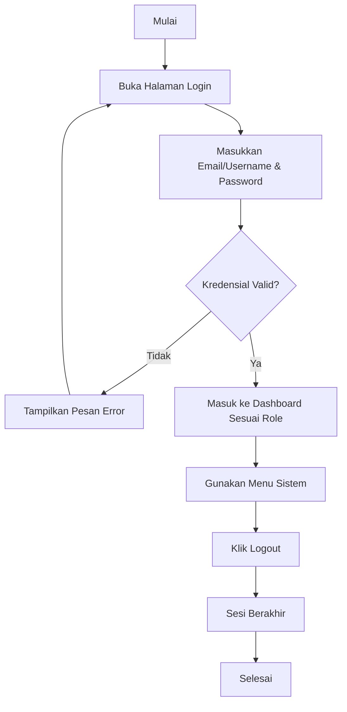
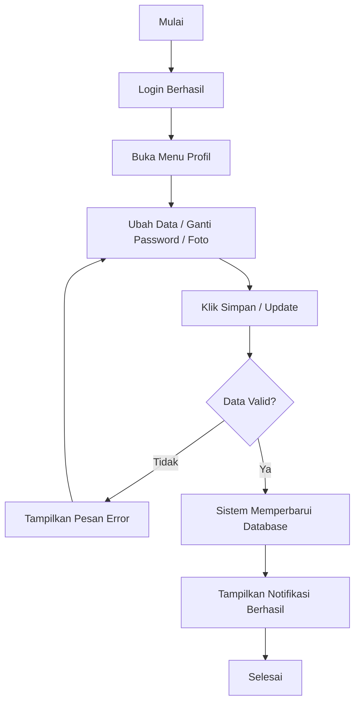
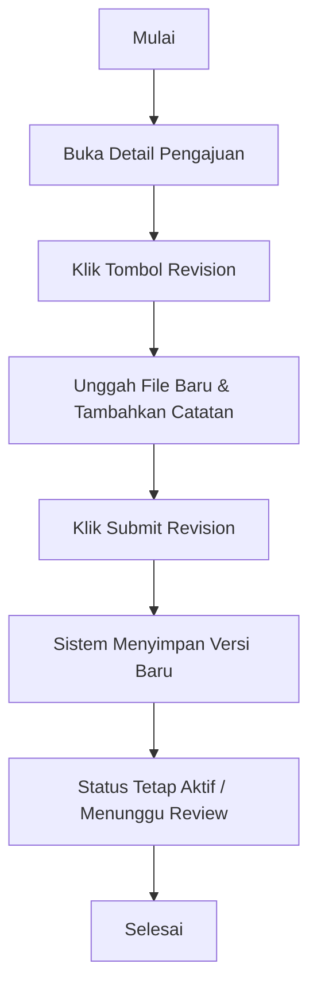
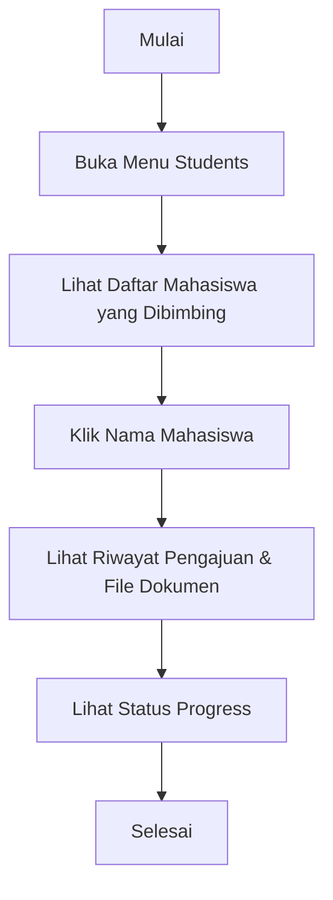
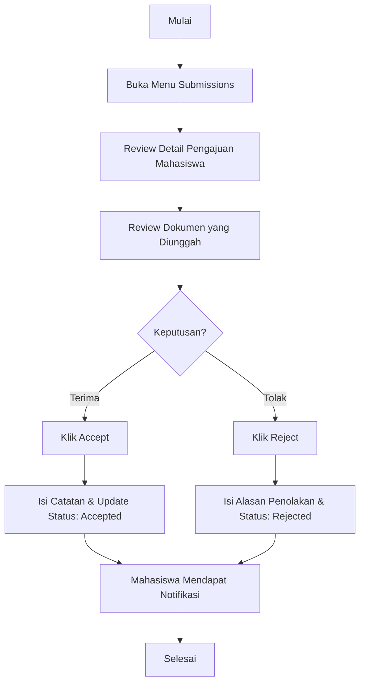
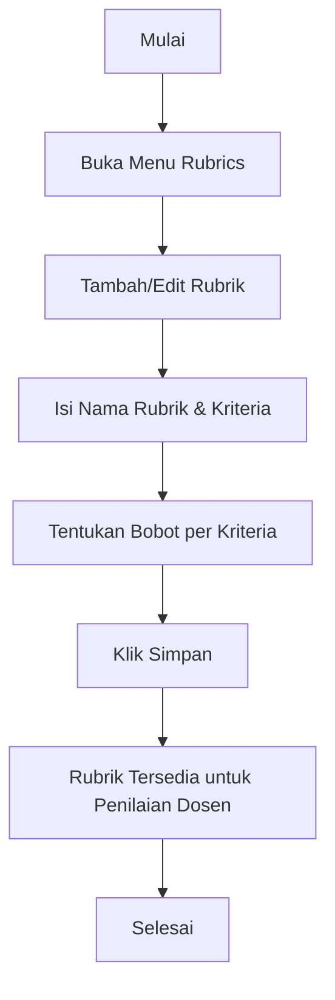
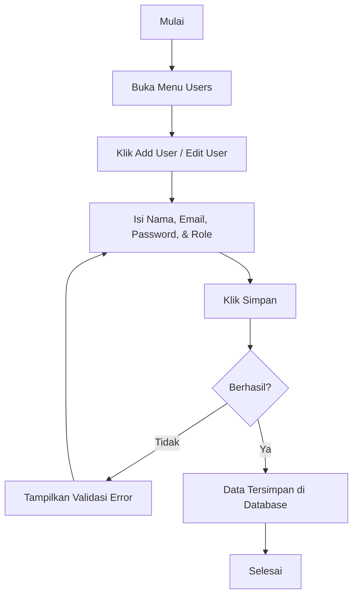

# Dokumen Activity Diagrams - Sistem Informasi Pengajuan TA

Dokumen ini berisi diagram aktivitas untuk setiap peran pengguna (Mahasiswa, Dosen, Kaprodi, dan Admin) berdasarkan menu dan fungsi yang tersedia di dalam sistem.

---

## 1. Aktivitas Umum (Common Activities)

Aktivitas yang dapat dilakukan oleh hampir seluruh pengguna yang terautentikasi.

### 1.1. Autentikasi (Login & Logout)



### 1.2. Manajemen Profil



---

## 2. Role: Mahasiswa

Fokus utama mahasiswa adalah pada pengajuan dan pemantauan status Tugas Akhir.

### 2.1. Pengajuan TA (Submission Process)

```mermaid
flowchart TD
    Start[Mulai] --> A[Buka Menu Submissions]
    A --> B[Klik 'Create New Submission']
    B --> C[Isi Judul, Abstrak, & Data Lainnya]
    C --> D[Unggah File Dokumen (.pdf/doc)]
    D --> E{Aksi?}
    E -- Simpan Draft --> F[Status: Draft]
    E -- Submit --> G[Status: Submitted]
    F --> H[Bisa Diedit Kembali Nanti]
    G --> I[Sistem Mengunci Form]
    I --> J[Notifikasi ke Dosen/Kaprodi]
    H --> End[Selesai]
    J --> End
```

### 2.2. Revisi Dokumen



### 2.3. Pembatalan Pengajuan

```mermaid
flowchart TD
    Start[Mulai] --> A[Buka Detail Pengajuan (Status: Submitted/Draft)]
    A --> B[Klik Tombol Cancel]
    B --> C{Konfirmasi?}
    C -- Tidak --> End
    C -- Ya --> D[Status Berubah: Canceled]
    D --> E[Pengajuan Tidak Lagi Diproses]
    E --> End[Selesai]
```

---

## 3. Role: Dosen (Pembimbing & Penguji)

Fokus utama dosen adalah pada bimbingan dan penilaian.

### 3.1. Monitoring Mahasiswa Bimbingan



### 3.2. Proses Penilaian (Assessment)

```mermaid
flowchart TD
    Start[Mulai] --> A[Buka Menu Assessments]
    A --> B[Pilih Mahasiswa/Pengajuan yang Akan Dinilai]
    B --> C[Klik 'Add Score' / Edit Assessment]
    C --> D[Isi Nilai Berdasarkan Kriteria]
    D --> E[Tambahkan Catatan / Saran]
    E --> F{Simpan sebagai Draft?}
    F -- Ya --> G[Nilai Disimpan (Bisa Diubah)]
    F -- Tidak --> H[Submit Score (Final)]
    H --> I[Nilai Terkunci & Masuk ke Rekapitulasi]
    G --> End
    I --> End
```

---

## 4. Role: Kaprodi (Kepala Program Studi)

Kaprodi memiliki peran manajerial dan verifikasi.

### 4.1. Verifikasi Pengajuan (Accept/Reject)



### 4.2. Penempatan Dosen (Assign Lecturers)

```mermaid
flowchart TD
    Start[Mulai] --> A[Pilih Pengajuan (Status: Accepted)]
    A --> B[Klik Assign Lecturers]
    B --> C[Pilih Dosen Pembimbing]
    C --> D[Pilih Dosen Penguji]
    D --> E[Klik Save Assignment]
    E --> F[Dosen & Mahasiswa Mendapat Notifikasi]
    F --> End[Selesai]
```

### 4.3. Manajemen Rubrik Penilaian



---

## 5. Role: Admin

Admin mengelola infrastruktur data dan pengguna.

### 5.1. Manajemen Pengguna (User Management)



### 5.2. Konfigurasi Sistem

```mermaid
flowchart TD
    Start[Mulai] --> A[Buka Menu Configuration]
    A --> B[Ubah Pengaturan (Deadline, Similarity Threshold, etc.)]
    B --> C[Klik Update Configuration]
    D[Sistem Menerapkan Perubahan Global]
    C --> D
    D --> End[Selesai]
```

### 5.3. Monitoring Activity Log

```mermaid
flowchart TD
    Start[Mulai] --> A[Buka Menu Activity Logs]
    A --> B[Filter berdasarkan User / Waktu / Aktivitas]
    B --> C[Review Log Aktivitas Sistem]
    C --> D[Unduh Log (Jika Diperlukan)]
    D --> End[Selesai]
```
