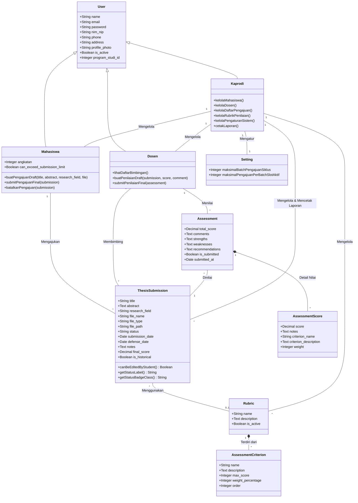

# Class Diagram

Diagram Kelas (*Class Diagram*) ini menggambarkan struktur statis sistem dengan menunjukkan kelas-kelas yang ada (beserta atribut dan metodenya) serta hubungan antarkelas (Generalisasi/Pewarisan, Asosiasi, dan Komposisi). Diagram ini diselaraskan secara **presisi 100% dengan model Eloquent Laravel dan skema database aktual** (seperti `ThesisSubmission`, `Assessment`, dll.), serta disederhanakan dengan menyatukan berkas lampiran langsung ke kelas pengajuan utama demi kemudahan pemahaman akademis.

